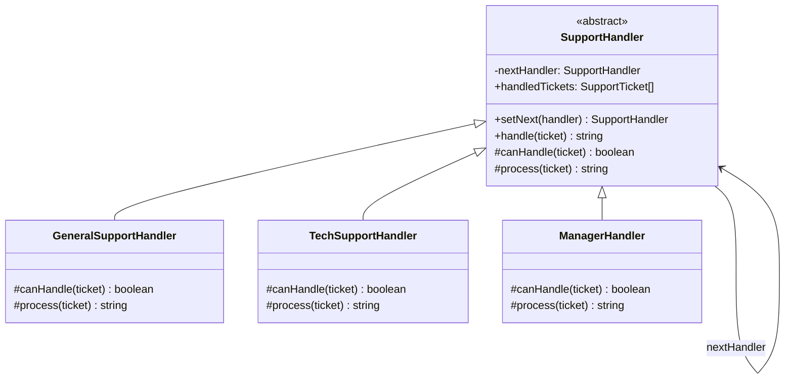

# Chain of Responsibility 패턴

**분류**: Behavioral (행동 패턴)

---

## 의도 (Intent)

요청을 보내는 객체와 처리하는 객체를 분리한다. 여러 핸들러를 사슬(chain)로 연결하고, 각 핸들러는 요청을 처리하거나 다음 핸들러로 전달하는 방식으로 동작한다.

---

## 핵심 개념 설명

Chain of Responsibility 패턴의 핵심은 **요청이 처리될 때까지 체인을 따라 전달**된다는 것이다.

일상의 예를 들면: 회사에서 지출 승인을 받을 때, 소액은 팀장이, 중간 금액은 부서장이, 고액은 CFO가 승인한다. 요청자는 팀장에게만 제출하면 되고, 팀장이 처리할 수 없으면 알아서 위로 전달한다.

이 패턴의 두 가지 핵심 결정:
1. **누가 처리하는가**: 각 핸들러가 `canHandle()`로 스스로 판단한다.
2. **다음은 누구인가**: `setNext()`로 체인을 구성할 때 결정된다.

클라이언트는 체인의 첫 번째 핸들러에만 요청을 보내면 된다. 내부에서 어떤 핸들러가 처리했는지 알 필요가 없다.

이 예시에서는 일반 상담 → 기술 지원 → 매니저로 이어지는 고객 지원 시스템을 구현했다.

---

## 구조 다이어그램



---

## 실무 사용 사례

| 상황 | 설명 |
|------|------|
| **미들웨어 파이프라인** | Express.js의 `app.use()`, NestJS의 Guard/Interceptor/Pipe 체인 |
| **이벤트 버블링** | DOM 이벤트가 자식에서 부모로 전파되는 구조 |
| **로깅 레벨** | DEBUG → INFO → WARN → ERROR 레벨별 핸들러 |
| **인증/인가** | 토큰 검증 → 권한 확인 → 요청 처리 순서로 체인 구성 |
| **결재 라인** | 금액에 따라 팀장 → 부서장 → CEO 순으로 에스컬레이션 |

---

## 장단점

### 장점
- **단일 책임 원칙**: 각 핸들러는 자신이 처리할 수 있는 요청만 담당한다.
- **개방-폐쇄 원칙**: 새 핸들러를 체인에 추가해도 기존 코드를 수정하지 않아도 된다.
- **유연한 체인 구성**: 런타임에 체인의 순서나 구성을 변경할 수 있다.

### 단점
- **처리 보장 없음**: 체인의 끝까지 아무도 처리하지 못할 수 있다.
- **디버깅 어려움**: 요청이 어떤 핸들러에서 처리됐는지 추적하기 어렵다.
- **성능**: 체인이 길면 많은 핸들러를 순차적으로 거쳐야 한다.

---

## 관련 패턴

- **Decorator**: 체인처럼 객체를 연결하지만, Decorator는 기존 동작을 감싸서 확장하고 CoR은 요청을 한 곳에서만 처리한다.
- **Command**: Command를 CoR 체인에 전달해 처리할 핸들러를 동적으로 결정할 수 있다.
- **Composite**: 트리 구조의 컴포넌트가 부모로 요청을 전달하는 방식이 CoR과 유사하다.

## Vue 구현

### Vue에서 이 패턴이 어떻게 표현되는가

Vue에서 Chain of Responsibility는 **검증 핸들러 배열을 순서대로 실행하는 composable**로 구현한다. 폼 검증이 가장 자연스러운 활용 사례다.

```ts
function useValidationChain(handlers: ValidatorHandler[]) {
  function runChain(form: FormData) {
    for (const handler of handlers) {
      const result = handler.validate(form)
      if (!result.valid) {
        // 실패: 체인 중단
        return false
      }
      // 통과: 다음 핸들러로 계속
    }
    return true  // 모든 핸들러 통과
  }
  return { runChain, chainResults }
}
```

### TS 구현과의 차이점

| TypeScript | Vue |
|---|---|
| 추상 클래스 + `setNext()` 체인 연결 | 핸들러 배열 순회 |
| `nextHandler.handle()` 위임 | `for` 루프 + `break` |
| 클래스 상속으로 핸들러 구현 | 객체 리터럴 `{ validate }` |
| 체인 구성이 명시적 | 배열 순서가 체인 순서 |

### 사용된 Vue 개념

- **`reactive()`**: 폼 데이터를 반응형으로 관리해 실시간 입력 추적
- **핸들러 배열**: 클래스 상속 없이 `{ validate }` 객체 배열로 체인 표현
- **체인 결과 시각화**: 각 단계의 통과/실패/건너뜀 상태를 `ref` 배열로 관리해 UI에 반영

## React 구현

### React에서 이 패턴이 어떻게 표현되는가

각 핸들러가 `null`(통과) 또는 오류 메시지(처리)를 반환하는 함수로 표현된다.

```
runChain(handlers, request)
  → requiredHandler.handle(req)    null이면 다음으로
  → minLengthHandler.handle(req)   null이면 다음으로
  → specialCharHandler.handle(req) 오류 반환 → 체인 중단
  (이후 핸들러는 호출되지 않음)
```

- `null` 반환이 "다음 핸들러로 위임", `string` 반환이 "처리(체인 중단)"이다.
- TS에서 `if (this.nextHandler) return this.nextHandler.handle(ticket)`이었던 체인 전달이 `for` 루프로 대체됐다.
- 핸들러 순서를 배열로 관리하므로 런타임에 순서 변경, 핸들러 추가/제거가 쉽다.

### TS 구현과의 차이점

| TS 구현 | React 구현 |
|---|---|
| `setNext(handler)` 체인 연결 | 배열로 핸들러 순서 관리 |
| `nextHandler` 포인터 | `for` 루프로 순서 제어 |
| 추상 클래스 상속 | 핸들러 함수 + 타입 인터페이스 |

### 사용된 React 개념

- 함수형 핸들러: 클래스 없이 순수 함수로 핸들러 표현
- `useState`: 활성 핸들러 목록 + 검증 결과 관리
- 체인 시각화: 각 단계의 통과/실패를 실시간으로 표시

---

## Svelte 구현

### Svelte에서 이 패턴이 어떻게 표현되는가?

Svelte 5에서는 핸들러들을 **`$state` 배열**로 관리하고, **`$derived`** 가 입력값이 바뀔 때마다 체인을 자동으로 재실행한다. 각 핸들러는 처리 시 결과를 반환하고, 처리 불가 시 `null`을 반환해 다음 핸들러로 위임한다.

```svelte
<script lang="ts">
  let handlers = $state<ValidationHandler[]>([...])
  let inputValue = $state('')

  // 입력값 변경 시 체인 자동 재실행
  let chainTrace = $derived.by(() => {
    for (const handler of handlers) {
      const result = handler.handle(inputValue)
      if (result) return [...trace, result]  // 처리됨 → 중단
      trace.push({ handled: false, ... })     // null → 다음으로
    }
  })
</script>
```

### TS 구현과의 차이점

| TypeScript | Svelte 5 |
|-----------|---------|
| 추상 클래스 + `setNext()` 체인 | 핸들러 배열을 순서대로 실행 |
| `nextHandler.handle()` 재귀 위임 | `null` 반환으로 다음 핸들러 진행 |
| `canHandle()` 추상 메서드 | 각 핸들러의 `handle()` 함수 자체가 판단 |

### 사용된 Svelte 5 개념

- **`$state`**: 핸들러 목록을 반응형으로 관리 (핸들러 활성화/비활성화 가능)
- **`$derived.by()`**: 입력값 변경 시 체인 자동 재실행, 단계별 추적 반환
- **반응형 UI**: 핸들러 ON/OFF 즉시 반영, 결과 실시간 업데이트
