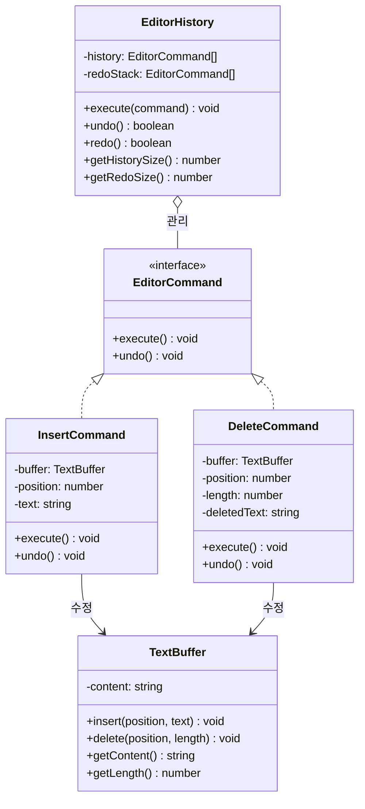

# Command 패턴

**분류**: Behavioral (행동 패턴)

---

## 의도 (Intent)

요청을 객체로 캡슐화한다. 이를 통해 요청을 큐에 저장하거나, 로깅하거나, 실행 취소(undo)가 가능한 연산을 지원할 수 있다.

---

## 핵심 개념 설명

Command 패턴의 핵심 아이디어는 **"무엇을 할지"를 객체로 만드는 것**이다.

일반적으로 `button.onClick(() => editor.insert(...))`처럼 동작을 즉시 실행한다. Command 패턴에서는 이 동작을 `InsertCommand` 객체로 만들어 저장해 두고, 나중에 실행하거나 취소하거나 재실행할 수 있다.

이것이 undo/redo를 가능하게 하는 원리다:
- **execute()**: 작업을 수행하고 이력 스택에 push
- **undo()**: execute()의 역방향 연산을 수행하고 redo 스택으로 이동
- **redo()**: undo()된 명령을 다시 execute()

이 예시에서는 텍스트 에디터의 삽입/삭제 명령과 undo/redo 히스토리를 구현했다.

---

## 구조 다이어그램



---

## 실무 사용 사례

| 상황 | 설명 |
|------|------|
| **텍스트 에디터** | Ctrl+Z/Y로 undo/redo 구현 |
| **데이터베이스 트랜잭션** | 명령을 큐에 쌓고 한꺼번에 커밋하거나 롤백 |
| **게임 리플레이** | 플레이어 입력을 Command로 저장해 재생 |
| **UI 버튼/메뉴** | 버튼이 직접 로직을 갖지 않고 Command 객체를 실행 |
| **매크로 기록** | 여러 Command를 순서대로 저장해 한 번에 재실행 |

---

## 장단점

### 장점
- **undo/redo 구현**: 명령 이력을 저장하면 실행 취소가 자연스럽게 구현된다.
- **단일 책임 원칙**: Invoker는 명령 관리만, Receiver는 실제 작업만 담당한다.
- **지연 실행**: 명령을 생성하는 시점과 실행하는 시점을 분리할 수 있다.
- **명령 조합**: 여러 Command를 묶어 매크로(복합 명령)를 만들 수 있다.

### 단점
- **클래스 수 증가**: 명령 하나마다 클래스가 필요하다.
- **복잡성**: 단순한 버튼 클릭에 Command 패턴을 적용하면 과설계가 될 수 있다.

---

## 관련 패턴

- **Memento**: Command와 함께 사용해 undo를 더 정교하게 구현할 수 있다. Command는 무엇을 되돌릴지, Memento는 어떤 상태로 되돌릴지를 담당한다.
- **Chain of Responsibility**: 요청을 처리할 핸들러를 찾는 방식으로, Command를 체인에 전달할 수 있다.
- **Strategy**: 둘 다 행동을 캡슐화하지만, Strategy는 교체 가능한 알고리즘에 초점을 두고 Command는 실행 이력과 취소에 초점을 둔다.

## Vue 구현

### Vue에서 이 패턴이 어떻게 표현되는가

Vue에서 Command는 **`execute/undo` 쌍을 가진 객체를 `ref` 배열(스택)로 관리**하는 composable로 구현한다.

```ts
function useTextEditor() {
  const content = ref('')  // Receiver (TextBuffer)
  const history = ref<EditorCommand[]>([])  // Invoker (undo 스택)
  const redoStack = ref<EditorCommand[]>([])  // Invoker (redo 스택)

  function insert(position: number, text: string) {
    const command: EditorCommand = {
      description: `삽입: "${text}"`,
      execute() { content.value = content.value.slice(0, position) + text + ... },
      undo()    { content.value = content.value.slice(0, position) + content.value.slice(position + text.length) },
    }
    command.execute()
    history.value.push(command)
    redoStack.value = []  // 새 명령 시 redo 무효화
  }

  function undo() {
    const cmd = history.value.pop()
    cmd?.undo()
    redoStack.value.push(cmd!)
  }
}
```

### TS 구현과의 차이점

| TypeScript | Vue |
|---|---|
| `TextBuffer` 클래스 (Receiver) | `ref(content)` |
| `EditorHistory` 클래스 (Invoker) | `useTextEditor()` composable 내부 |
| `InsertCommand` / `DeleteCommand` 클래스 | 인라인 객체 리터럴 |
| `history` / `redoStack` 배열 | `ref<EditorCommand[]>` |

### 사용된 Vue 개념

- **`ref()`**: 텍스트 내용(Receiver)과 명령 스택(Invoker)을 반응형으로 관리
- **`computed()`**: `canUndo` / `canRedo` 버튼 활성화 상태 자동 계산
- **클로저**: 명령 객체가 `position`, `text` 등을 클로저로 캡처해 undo 시 복원

## React 구현

### React에서 이 패턴이 어떻게 표현되는가

Command 객체가 `execute/undo` 순수 함수 쌍으로 구현되고, `useCommandHistory()` 훅이 Invoker 역할을 한다.

```
Command 객체
  ├─ execute(text) → 새 텍스트 반환 (순수 함수)
  └─ undo(text)    → 이전 텍스트 반환 (순수 함수)

useCommandHistory()              ← Invoker (EditorHistory)
  ├─ execute(command)            ← history에 추가 + 텍스트 변환
  ├─ undo()                      ← history에서 꺼내 undo() 호출
  ├─ redo()                      ← redoStack에서 꺼내 execute() 호출
  ├─ history: Command[]          ← 실행 이력 스택
  └─ redoStack: Command[]        ← undo 이력 스택
```

- TS의 `command.execute()`가 `TextBuffer`를 직접 변경했던 것과 달리, React에서는 Command가 **순수 함수**로 새 텍스트를 반환한다. 이것이 불변성을 유지하는 React 방식이다.
- `deleteCommand(position, length, currentText)`가 생성 시점의 텍스트를 클로저로 캡처해 undo에 사용한다.

### TS 구현과의 차이점

| TS 구현 | React 구현 |
|---|---|
| `command.execute()` → Receiver 직접 변경 | `command.execute(text)` → 새 텍스트 반환 (순수) |
| `class InsertCommand` | `insertCommand()` 팩토리 함수 |
| `class EditorHistory` | `useCommandHistory()` 훅 |
| `TextBuffer` Receiver | `useState`로 관리되는 텍스트 상태 |

### 사용된 React 개념

- `useState`: 텍스트 상태 + history/redoStack 관리
- 클로저: `deleteCommand`가 undo용 원본 텍스트를 캡처
- 순수 함수 Command: 부작용 없이 텍스트를 변환

---

## Svelte 구현

### Svelte에서 이 패턴이 어떻게 표현되는가?

Svelte 5에서는 각 명령을 **`{ label, execute, undo }` 객체 리터럴**로 표현하고, **`$state` 배열**이 Invoker의 history/redoStack 역할을 한다. Receiver(`TextBuffer`)는 `$state content` 문자열로 단순화된다.

```svelte
<script lang="ts">
  let content = $state('')
  let historyStack = $state<CommandRecord[]>([])
  let redoStack = $state<CommandRecord[]>([])

  function createInsertCommand(pos: number, text: string) {
    return {
      label: `삽입 "${text}"`,
      execute() { content = content.slice(0, pos) + text + content.slice(pos) },
      undo() { content = content.slice(0, pos) + content.slice(pos + text.length) },
    }
  }

  function undo() {
    const cmd = historyStack.at(-1)
    cmd?.undo()
    historyStack = historyStack.slice(0, -1)
    redoStack = [...redoStack, cmd!]
  }
</script>
```

### TS 구현과의 차이점

| TypeScript | Svelte 5 |
|-----------|---------|
| `EditorCommand` 인터페이스 + 클래스 | `{ execute, undo }` 객체 리터럴 |
| `EditorHistory` 클래스 (스택 관리) | `$state` 배열 두 개 (history + redo) |
| `TextBuffer` 클래스 | `$state content` 문자열 |

### 사용된 Svelte 5 개념

- **`$state`**: 텍스트 버퍼와 명령 이력 스택을 반응형으로 관리
- **`$derived`**: undo/redo 가능 여부 자동 계산
- **클로저**: 명령 생성 시점에 삭제될 텍스트를 캡처해 undo에 활용
