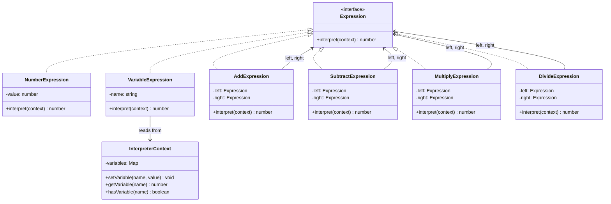

# Interpreter 패턴

**분류**: Behavioral (행동 패턴)

---

## 의도 (Intent)

특정 언어(문법)에 대한 인터프리터를 정의한다.
언어의 각 문법 규칙을 클래스로 표현하고, 문장을 이 클래스들의 트리로 구성한 뒤 재귀적으로 해석한다.

---

## 핵심 개념 설명

### 문제: 반복되는 문법 해석

특정 패턴이 반복되는 문제(예: SQL 쿼리, 정규식, 수식 계산)를 처리할 때,
매번 파싱 로직을 새로 작성하는 것은 비효율적이다.

### 해결: 문법 규칙을 클래스로 표현

문법의 각 규칙을 하나의 클래스로 만들고, 문장은 이 클래스들의 **트리(AST: Abstract Syntax Tree)**로 표현한다.
해석(interpret)은 트리를 재귀적으로 순회하며 각 노드를 평가하는 것이다.

### 수식 예시: `3 + 4 * 2`

```
        Add
       /   \
    Number   Multiply
      3      /      \
           Number  Number
             4       2
```

```typescript
new AddExpression(
  new NumberExpression(3),
  new MultiplyExpression(
    new NumberExpression(4),
    new NumberExpression(2)
  )
).interpret(context)  // → 11
```

### Terminal vs Nonterminal

| 종류 | 설명 | 예시 |
|------|------|------|
| **TerminalExpression** | 더 이상 분해되지 않는 가장 기본 단위 (트리의 잎) | 숫자, 변수 이름 |
| **NonterminalExpression** | 하위 식을 포함하는 복합 식 (트리의 노드) | 덧셈, 곱셈, 뺄셈 |

### 후위 표기법(RPN) 파서

중위 표기법(`3 + 4`)은 연산자 우선순위와 괄호 처리가 복잡하므로,
후위 표기법(Reverse Polish Notation, `3 4 +`)을 사용하면 스택만으로 간단히 파싱할 수 있다.

```
"3 4 2 * +"  →  스택 기반 파싱  →  Add(3, Multiply(4, 2))  →  11
```

---

## 구조 다이어그램



---

## 실무 사용 사례

| 사례 | 설명 |
|------|------|
| **SQL 파서** | SQL 문법의 각 절(SELECT, WHERE, JOIN)을 Expression으로 표현한다 |
| **정규식 엔진** | 정규식 패턴을 Expression 트리로 변환해 문자열을 매칭한다 |
| **템플릿 언어** | Handlebars, Mustache 같은 템플릿 엔진이 내부적으로 Interpreter를 사용한다 |
| **수식 계산기** | 스프레드시트의 수식 계산 (`=SUM(A1:A10)`) |
| **DSL(Domain Specific Language)** | 특정 도메인에 특화된 언어를 정의하고 해석할 때 |
| **ESLint 규칙** | 코드 AST를 순회하면서 각 노드 타입에 맞는 규칙(Visitor)을 적용한다 |

---

## 장단점

### 장점

- **문법 변경 용이**: 새 문법 규칙을 추가하려면 새 Expression 클래스만 추가하면 된다.
- **조합 가능**: Expression들을 조합해 복잡한 문장을 표현할 수 있다 (Composite 패턴과 유사).
- **명확한 구조**: 각 클래스가 하나의 문법 규칙에 대응해 코드가 이해하기 쉽다.

### 단점

- **클래스 폭발**: 문법이 복잡할수록 클래스 수가 급격히 늘어난다.
- **성능**: 재귀 호출이 많고 객체 생성 비용이 있어, 복잡한 수식에는 성능 문제가 있을 수 있다.
- **복잡한 문법 부적합**: 문법이 매우 복잡하다면 Interpreter 패턴보다 파서 생성기(ANTLR 등)를 사용하는 것이 낫다.

---

## 관련 패턴

- **Composite**: Interpreter의 Expression 트리 구조는 Composite 패턴과 동일하다. Nonterminal Expression이 Composite 역할을 한다.
- **Iterator**: 생성된 AST 트리를 순회할 때 Iterator를 사용할 수 있다.
- **Visitor**: AST의 각 노드에 다양한 연산(타입 검사, 코드 생성 등)을 적용할 때 Visitor와 함께 사용한다.
- **Flyweight**: 자주 반복되는 Terminal Expression(예: 숫자 0, 1)을 Flyweight로 공유해 메모리를 절약할 수 있다.
