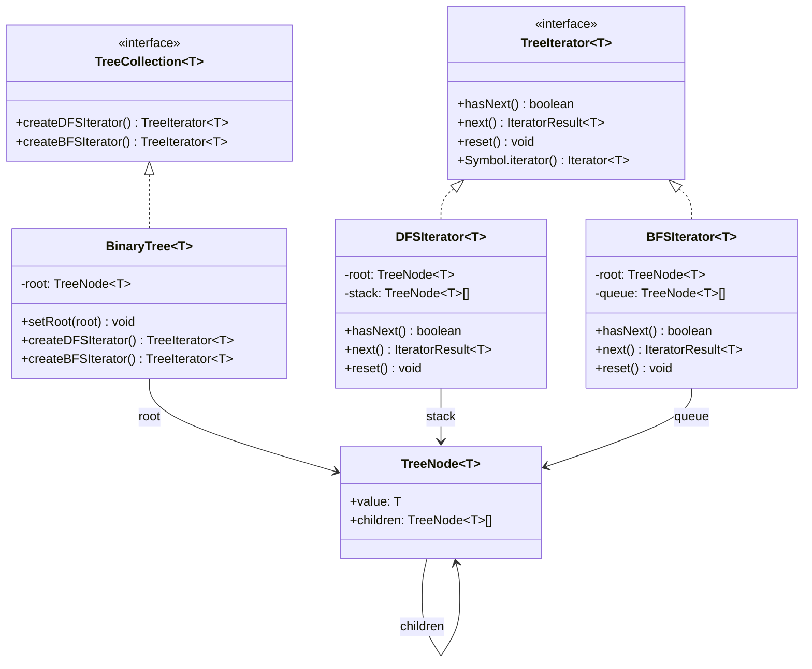

# Iterator 패턴

**분류**: Behavioral (행동 패턴)

---

## 의도 (Intent)

컬렉션의 내부 표현 방식을 노출하지 않으면서, 컬렉션의 요소들을 순차적으로 접근하는 방법을 제공한다.

---

## 핵심 개념 설명

### 문제: 컬렉션마다 다른 순회 방법

배열은 인덱스로, 트리는 DFS/BFS로, 그래프는 또 다른 방식으로 순회한다.
클라이언트가 각 컬렉션의 내부 구조를 알아야 한다면 코드가 복잡해지고 결합도가 높아진다.

### 해결: 순회 로직을 Iterator 객체로 분리

순회 방법을 Iterator 객체로 캡슐화한다.
클라이언트는 `hasNext()` / `next()` 라는 단일 인터페이스만 사용하면,
컬렉션의 내부 구조를 알 필요 없이 모든 요소를 순회할 수 있다.

### JavaScript Iterable 프로토콜

`Symbol.iterator`를 구현하면 `for...of`, 스프레드 연산자(`...`), 구조분해 등에서 자동으로 사용된다.

```typescript
const iterator = tree.createDFSIterator();
for (const value of iterator) {  // Symbol.iterator가 자동 호출된다
  console.log(value);
}
```

### DFS vs BFS 비교

```
트리:       1
           / \
          2   3
         / \
        4   5

DFS 순서: 1 → 2 → 4 → 5 → 3  (스택 사용, 깊이 우선)
BFS 순서: 1 → 2 → 3 → 4 → 5  (큐 사용, 너비 우선)
```

---

## 구조 다이어그램



---

## 실무 사용 사례

| 사례 | 설명 |
|------|------|
| **JavaScript 내장 Iterator** | `Array`, `Map`, `Set`, `String` 모두 Iterator를 구현한다 |
| **파일 시스템 탐색** | 디렉토리 트리를 DFS로 순회해 파일을 찾는다 |
| **DOM 트리 순회** | `NodeIterator`, `TreeWalker`가 Iterator 패턴을 따른다 |
| **데이터베이스 커서** | 쿼리 결과를 한 번에 로드하지 않고 순차적으로 읽는다 |
| **페이지네이션** | API 결과를 페이지 단위로 순차 접근한다 |
| **Generator 함수** | JavaScript의 `function*`이 Iterator 패턴의 언어 내장 구현이다 |

---

## 장단점

### 장점

- **단일 책임 원칙**: 순회 로직과 컬렉션 로직이 분리된다.
- **개방/폐쇄 원칙**: 기존 컬렉션을 수정하지 않고 새 Iterator를 추가할 수 있다.
- **병렬 순회**: 같은 컬렉션에 여러 Iterator를 동시에 사용할 수 있다 (각각 독립적인 커서).
- **통일된 인터페이스**: 어떤 컬렉션이든 같은 방식으로 순회할 수 있다.

### 단점

- **오버헤드**: 단순 배열처럼 직접 인덱스 접근이 가능한 경우에는 Iterator가 불필요하게 복잡할 수 있다.
- **상태 관리**: Iterator가 상태(현재 위치)를 갖기 때문에, 컬렉션이 변경되면 Iterator가 무효화될 수 있다.

---

## 관련 패턴

- **Composite**: 재귀적 구조(트리)를 순회할 때 Iterator와 자주 함께 사용된다.
- **Factory Method**: 컬렉션이 적합한 Iterator를 생성할 때 Factory Method를 사용할 수 있다.
- **Memento**: Iterator의 현재 상태(커서 위치)를 Memento로 저장해 나중에 복원할 수 있다.
- **Visitor**: 컬렉션을 Iterator로 순회하면서 각 요소에 Visitor를 적용하는 조합이 흔하다.
