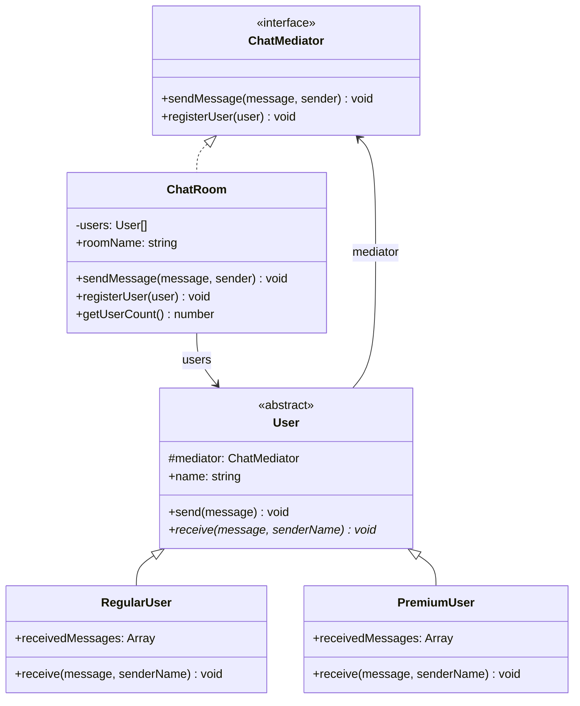

# Mediator 패턴

**분류**: Behavioral (행동 패턴)

---

## 의도 (Intent)

객체들이 서로 직접 참조하지 않고, 중재자(Mediator) 객체를 통해서만 통신하도록 강제한다.
이를 통해 객체 간의 결합도를 낮추고, 통신 로직을 한 곳에서 집중 관리할 수 있다.

---

## 핵심 개념 설명

### 문제: 스파게티 통신

여러 객체가 서로 직접 참조하면, N개의 객체 사이에 최대 N×(N-1)/2개의 관계가 생긴다.
각 객체가 다른 모든 객체를 알아야 하므로, 하나를 바꾸면 연관된 모든 객체를 수정해야 한다.

```
앨리스 ←→ 밥
  ↕    ✕   ↕
찰리 ←→ 데이브
```

### 해결: 중재자 도입

중재자를 도입하면 모든 통신이 중재자를 거친다.
각 객체는 오직 중재자만 알면 되므로 관계가 단순해진다.

```
앨리스 → ChatRoom → 밥
찰리  →            → 데이브
```

### Double Dispatch 없이 동작하는 방법

- **Colleague(동료 객체)**: `mediator.sendMessage(msg, this)` 를 호출하며, `this`(자기 자신)를 함께 넘긴다.
- **Mediator**: 누가 보냈는지(`sender`)를 알기 때문에, 보낸 사람을 제외한 나머지에게만 전달한다.
- 동료들은 서로의 존재를 전혀 모른다.

---

## 구조 다이어그램



---

## 실무 사용 사례

| 사례 | 설명 |
|------|------|
| **채팅 서버** | 사용자들이 서버(중재자)를 통해 메시지를 주고받는다 |
| **항공 관제탑** | 비행기들은 서로 직접 통신하지 않고 관제탑을 통해 정보를 교환한다 |
| **UI 이벤트 버스** | React의 Context, Vue의 EventBus 등 컴포넌트 간 통신 중재 |
| **MVC의 Controller** | Model과 View가 Controller를 통해 상호작용한다 |
| **Node.js EventEmitter** | 이벤트 발행자와 구독자 사이의 중재 역할 |

---

## 장단점

### 장점

- **낮은 결합도**: 동료 객체들이 서로를 직접 알 필요가 없다.
- **단일 책임 원칙**: 통신 로직이 중재자 한 곳에 집중된다.
- **재사용성 향상**: 동료 객체들이 독립적이므로 다른 맥락에서도 재사용하기 쉽다.
- **유지보수 용이**: 통신 규칙을 바꾸려면 중재자만 수정하면 된다.

### 단점

- **중재자 비대화**: 로직이 중재자에 집중되면서 "God Object"가 될 위험이 있다.
- **복잡성 이동**: 객체 간 복잡성이 사라지는 대신, 중재자 자체가 복잡해진다.

---

## 관련 패턴

- **Observer**: Mediator는 일대다 관계를 직접 관리하지만, Observer는 발행-구독 모델로 느슨하게 연결한다.
- **Facade**: Facade는 서브시스템에 단순한 인터페이스를 제공하지만 단방향이다. Mediator는 양방향 통신을 중재한다.
- **Command**: Mediator와 함께 사용해 각 통신 요청을 Command 객체로 캡슐화할 수 있다.

## Vue 구현

### Vue에서 이 패턴이 어떻게 표현되는가

Vue에서 Mediator는 **`provide/inject`를 통한 컴포넌트 간 통신 중재**로 구현한다. ChatRoom 컴포넌트가 `provide`로 중재자를 주입하고, UserPanel들이 `inject`로 접근한다.

```ts
// ChatRoom.vue — ConcreteMediator: provide로 중재자 주입
provide(ChatRoomKey, { registerUser, sendMessage, users, globalLog })

function sendMessage(senderName: string, text: string) {
  users.forEach(user => {
    if (user.name !== senderName) {
      user.inbox.push({ sender: senderName, text })  // 직접 통신 차단
    }
  })
}
```

```ts
// UserPanel.vue — ConcreteColleague: inject로 중재자 획득
const chatRoom = inject(ChatRoomKey)  // 다른 UserPanel을 직접 참조하지 않음

function sendMessage() {
  chatRoom.sendMessage(myName, text)  // 중재자에게 위임
}
```

### TS 구현과의 차이점

| TypeScript | Vue |
|---|---|
| 생성자 주입 (`new User(mediator, name)`) | `inject(ChatRoomKey)` |
| `mediator.registerUser(this)` | `onMounted(() => chatRoom.registerUser(...))` |
| `RegularUser` / `PremiumUser` 클래스 | `UserPanel` 컴포넌트 + `userType` prop |
| `ChatRoom` 클래스 | `ChatRoom.vue` 컴포넌트 |

### 사용된 Vue 개념

- **`provide` / `inject`**: TypeScript 생성자 주입을 Vue 컴포넌트 트리에서 구현
- **`InjectionKey`**: Symbol + 제네릭으로 타입 안전한 provide/inject
- **`onMounted()`**: 컴포넌트 마운트 시 중재자에 자동 등록 (생성자 등록과 동일)
- **`reactive()`**: 사용자 목록과 메시지 로그를 반응형으로 관리

## React 구현

### React에서 이 패턴이 어떻게 표현되는가

Context가 Mediator 역할을 한다. 컴포넌트들은 Context를 통해서만 통신하고 서로를 직접 참조하지 않는다.

```
ChatProvider (ConcreteMediator = ChatRoom)
  └─ ChatContext (Mediator 인터페이스)
       ├─ sendMessage(from, content, to)   ← ChatRoom.sendMessage()
       ├─ registerUser(name, type)
       └─ getMessagesFor(name)

useChat(userName, type)          ← Colleague (User)
  ├─ send(content, to?)          ← User.send() → Mediator에 위임
  └─ receivedMessages            ← Mediator가 라우팅한 메시지

UserPanel A ──┐
UserPanel B ──┤  ChatContext(Mediator)를 통해서만 통신
UserPanel C ──┘
(서로 직접 참조 없음)
```

- 각 `UserPanel`은 다른 `UserPanel`을 import하거나 props로 참조하지 않는다.
- `ChatProvider`에서 메시지 라우팅 로직을 변경하면 모든 컴포넌트에 자동으로 반영된다.
- 차단, 귓속말, 브로드캐스트 등 새 기능은 `ChatProvider`에만 추가하면 된다.

### TS 구현과의 차이점

| TS 구현 | React 구현 |
|---|---|
| `ChatRoom implements ChatMediator` | `ChatProvider` + `ChatContext` |
| `User` 추상 클래스 | `useChat()` 커스텀 훅 |
| 생성자에서 `mediator.registerUser(this)` | `useEffect`로 마운트 시 등록 |
| `console.log`로 메시지 출력 | `useState`로 메시지 목록 유지 + UI 렌더링 |

### 사용된 React 개념

- `createContext` / `useContext`: Mediator를 전역으로 제공
- `ChatProvider`: 메시지 라우팅 로직의 단일 책임
- `useCallback` + `useRef`: 등록된 사용자 목록 관리 (리렌더링 최소화)

---

## Svelte 구현

### Svelte에서 이 패턴이 어떻게 표현되는가?

Svelte 5에서는 **`$state` 채팅방 배열**이 ConcreteMediator 역할을 하고, **`sendMessage()` 함수**가 모든 라우팅 로직을 담당한다. 사용자들은 서로를 직접 참조하지 않고, 오직 `sendMessage(senderId, roomId, message)` 함수만 호출한다.

```svelte
<script lang="ts">
  let users = $state<ChatUser[]>([...])
  let rooms = $state<ChatRoom[]>([...])

  // ConcreteMediator.sendMessage() — 모든 라우팅 여기에 집중
  function sendMessage(senderId: number, roomId: number, message: string) {
    const room = rooms.find(r => r.id === roomId)!
    room.messages = [...room.messages, { from: sender.name, message }]

    // 발신자 제외, 채팅방 멤버에게만 전달
    users = users.map(user => {
      if (user.id === senderId || !room.memberIds.includes(user.id)) return user
      return { ...user, inbox: [{ from: sender.name, message }, ...user.inbox] }
    })
  }
</script>
```

### TS 구현과의 차이점

| TypeScript | Svelte 5 |
|-----------|---------|
| `ChatRoom implements ChatMediator` 클래스 | `$state` 배열 + `sendMessage()` 함수 |
| `User.send()` → `mediator.sendMessage(msg, this)` | UI에서 직접 `sendMessage(id, roomId, msg)` |
| `user.receive()` 메서드 | `user.inbox`에 메시지 추가 |
| 프리미엄 사용자 다형성 | `user.type === 'premium'` 조건 분기 |

### 사용된 Svelte 5 개념

- **`$state`**: 사용자 목록과 채팅방 목록을 반응형으로 관리
- **`$derived`**: 현재 채팅방의 멤버 목록 자동 계산
- **중앙화 라우팅**: `sendMessage()` 하나에 모든 전달 로직을 집중해 결합도를 낮춤
