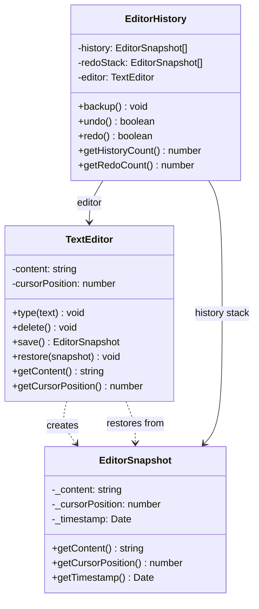

# Memento 패턴

**분류**: Behavioral (행동 패턴)

---

## 의도 (Intent)

객체의 내부 상태를 캡슐화해서 외부에 저장하고, 나중에 그 상태로 되돌릴 수 있게 한다.
이 과정에서 캡슐화를 위반하지 않는다 — 즉, 저장된 상태의 내부를 외부에서 볼 수 없다.

---

## 핵심 개념 설명

### 문제: 상태 복원과 캡슐화의 충돌

undo/redo를 구현하려면 과거 상태를 저장해야 한다.
가장 단순한 방법은 상태를 외부에 직접 노출하는 것이지만, 이는 캡슐화를 깨뜨린다.
외부 코드가 내부 상태를 직접 건드리면 나중에 내부 구현을 바꾸기 어려워진다.

### 해결: 세 역할의 분리

| 역할 | 클래스 | 책임 |
|------|--------|------|
| **Originator** | `TextEditor` | 자신의 상태를 Memento로 저장하고 복원한다 |
| **Memento** | `EditorSnapshot` | 특정 시점의 상태를 불변으로 보관한다 |
| **Caretaker** | `EditorHistory` | Memento를 보관하지만 내용은 알 수 없다 |

### 캡슐화 유지 원리

```
TextEditor (Originator)
  ├── save()     → EditorSnapshot 생성 (내부 상태를 자신만 알 수 있는 방식으로 저장)
  └── restore()  → EditorSnapshot에서 상태 복원 (자신만이 복원 방법을 안다)

EditorHistory (Caretaker)
  ├── Memento를 Stack으로 보관
  └── 내부 내용은 접근 불가 (불투명한 토큰처럼 취급)
```

### Undo/Redo 스택 동작

```
상태:   ''  →  'A'  →  'AB'  →  undo  →  redo
히스토리: [''  ,  'A' ]         ['A' ]   ['A', 'AB']
redo:  []                    ['AB']   []
현재:  'AB'              →   'A'   →  'AB'
```

---

## 구조 다이어그램



---

## 실무 사용 사례

| 사례 | 설명 |
|------|------|
| **텍스트 에디터** | Ctrl+Z / Ctrl+Y (undo/redo) |
| **게임 세이브** | 특정 시점의 게임 상태를 저장하고 불러온다 |
| **트랜잭션 롤백** | DB 트랜잭션 실패 시 이전 상태로 복구한다 |
| **폼 초기화** | "변경 취소" 버튼으로 원래 값으로 되돌린다 |
| **스냅샷 테스트** | Jest의 스냅샷 테스트가 Memento 개념을 활용한다 |

---

## 장단점

### 장점

- **캡슐화 보존**: Originator의 내부 구조를 노출하지 않고 상태를 저장할 수 있다.
- **단순한 Originator**: 상태 관리 책임이 외부(Caretaker)로 분리되어 Originator가 단순해진다.
- **여러 undo 지원**: 스택을 사용해 여러 단계의 undo를 자연스럽게 구현할 수 있다.

### 단점

- **메모리 사용량**: 상태를 자주 저장하면 메모리를 많이 사용한다. 큰 객체라면 더 심각하다.
- **직렬화 어려움**: Memento를 파일이나 네트워크로 전송하려면 직렬화 로직이 필요하다.
- **얕은 복사 주의**: 참조 타입 필드는 깊은 복사가 필요하다. 그렇지 않으면 복원 후에도 원본이 바뀔 수 있다.

---

## 관련 패턴

- **Command**: Command 패턴과 함께 사용하면 각 Command의 이전 상태를 Memento로 저장해 undo를 구현할 수 있다.
- **Iterator**: Iterator의 현재 위치를 Memento로 저장해 나중에 같은 위치에서 재개할 수 있다.
- **Prototype**: 객체 전체를 복사(clone)하는 것이 Memento를 만드는 간단한 대안이 될 수 있다.
