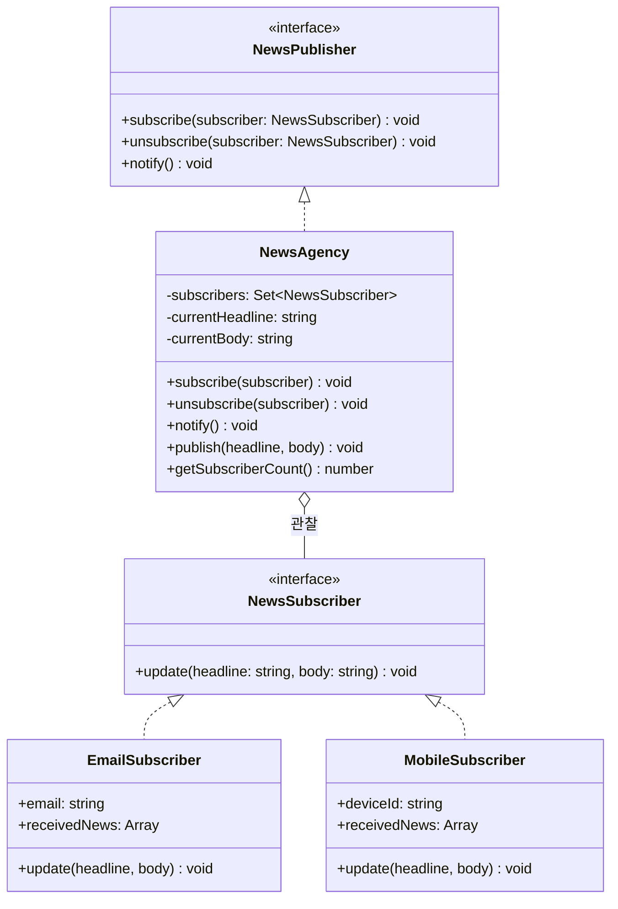

# Observer 패턴

**분류**: Behavioral (행동 패턴)

---

## 의도 (Intent)

객체 간에 일대다(one-to-many) 의존성을 정의한다. 한 객체(Subject)의 상태가 변경되면, 그 객체에 의존하는 모든 객체(Observer)가 자동으로 통보를 받고 업데이트된다.

---

## 핵심 개념 설명

Observer 패턴은 **발행-구독(publish-subscribe)** 모델의 기초다.

핵심 아이디어는 **느슨한 결합(loose coupling)**이다:
- **Subject(발행자)**: 구독자 목록을 관리한다. 구독자가 누구인지, 몇 명인지 알 필요가 없다. 단지 "알림을 보낼 대상 목록"만 유지한다.
- **Observer(구독자)**: `update()` 메서드 하나만 구현하면 된다. Subject가 어떤 클래스인지 알 필요가 없다.

두 쪽 모두 인터페이스에만 의존하므로, 새로운 구독자를 추가해도 발행자 코드를 전혀 수정할 필요가 없다.

이 예시에서는 뉴스 발행사(`NewsAgency`)가 여러 구독자(이메일, 모바일)에게 뉴스를 전달하는 시스템을 구현했다.

---

## 구조 다이어그램



---

## 실무 사용 사례

| 상황 | 설명 |
|------|------|
| **이벤트 시스템** | DOM의 `addEventListener`, Node.js의 `EventEmitter` |
| **상태 관리** | Redux의 `store.subscribe()`, MobX의 반응형 관찰 |
| **실시간 알림** | 주식 가격 변동 → 여러 화면에 동시 업데이트 |
| **MVC 아키텍처** | Model(Subject)이 변경되면 View(Observer)가 자동 갱신 |

---

## 장단점

### 장점
- **개방-폐쇄 원칙(OCP)**: 새 구독자 클래스를 추가해도 발행자 코드를 수정하지 않아도 된다.
- **느슨한 결합**: Subject와 Observer는 인터페이스로만 연결되어 독립적으로 변경 가능하다.
- **런타임 동적 구독/해제**: 실행 중에 자유롭게 구독 관계를 변경할 수 있다.

### 단점
- **예측 불가한 업데이트 순서**: 구독자가 많을 때 어떤 순서로 알림이 가는지 보장되지 않는다.
- **메모리 누수 위험**: 구독 해제를 잊으면 더 이상 필요 없는 Observer가 메모리에 남는다.
- **연쇄 업데이트 주의**: Observer가 Subject를 다시 변경하면 무한 루프가 발생할 수 있다.

---

## 관련 패턴

- **Mediator**: Observer가 일대다라면, Mediator는 다대다 통신을 중재한다.
- **Event Bus**: Observer 패턴을 전역으로 확장한 변형. 발행자와 구독자가 직접 참조를 공유하지 않는다.
- **Command**: 명령을 객체로 캡슐화해 Observer의 `update()` 대신 Command 객체를 전달하는 방식으로 조합할 수 있다.

## Vue 구현

### Vue에서 이 패턴이 어떻게 표현되는가

Vue의 반응형 시스템 자체가 Observer 패턴이다. `ref/reactive`가 Subject이고 `watch/watchEffect`가 Observer 등록 방법이다.

```ts
// Subject: 뉴스 상태
const currentNews = reactive({ headline: '', body: '' })

// Observer 등록: watch()로 구독
watch(currentNews, (news) => {
  emailInbox.value.push(news)  // EmailSubscriber.update()와 동일
})

// Observer 등록: watchEffect()로 구독 (의존성 자동 추적)
watchEffect(() => {
  if (currentNews.headline) logInbox.value.push(currentNews)
})

// notify: Subject 상태 변경 → 모든 Observer 자동 호출
currentNews.headline = '새 뉴스!'  // 이 한 줄이 notify()
```

### TS 구현과의 차이점

| TypeScript | Vue |
|---|---|
| `subscribe(observer)` 수동 등록 | `watch(state, callback)` |
| `notify()` 명시적 호출 | 반응형 상태 변경 시 자동 호출 |
| `Set<Observer>` 구독자 목록 | Vue 내부 의존성 추적 |
| `unsubscribe(observer)` | `watch()`가 반환하는 stop 함수 호출 |

### 사용된 Vue 개념

- **`watch()`**: 특정 반응형 값을 명시적으로 감시하는 Observer 등록
- **`watchEffect()`**: 내부에서 사용한 모든 반응형 값을 자동 추적하는 Observer 등록
- **`reactive()`**: 객체 전체를 Subject로 만들어 필드 변경을 한 번에 감지
- **수동 subscribe/unsubscribe**: composable로 명시적 구독 관리가 필요한 경우 구현 가능

## React 구현

### React에서 이 패턴이 어떻게 표현되는가

`useNewsPublisher()` 훅이 Subject, `useObserver()` 훅이 ConcreteObserver 역할을 한다.

```
useNewsPublisher()           ← Subject (NewsAgency)
  ├─ subscribersRef: Map     ← 구독자 목록 (Set 대신 Map으로 ID 기반 관리)
  ├─ subscribe(callback)     ← subscribe()
  ├─ unsubscribe(id)         ← unsubscribe()
  └─ publish(headline, body) ← publish() → notify() → 모든 콜백 호출

useObserver(publisher, id, name, type)  ← ConcreteObserver
  ├─ subscribe()   → publisher에 콜백 등록
  ├─ unsubscribe() → publisher에서 콜백 제거
  └─ receivedNews  → 수신된 뉴스 목록 (useState)
```

- `useRef`로 구독자 목록을 관리하는 이유: 구독자 변경이 Subject 컴포넌트를 리렌더링하면 안 되기 때문.
- 구독 해제 후에는 `publish()`를 호출해도 해당 Observer의 콜백이 호출되지 않는다.

### TS 구현과의 차이점

| TS 구현 | React 구현 |
|---|---|
| `Set<NewsSubscriber>` 구독자 목록 | `Map<string, SubscriberCallback>` (ID 기반) |
| `subscriber.update()` 직접 호출 | 콜백 함수 호출 |
| `EmailSubscriber` 클래스 | `useObserver()` 훅 + `SubscriberPanel` 컴포넌트 |

### 사용된 React 개념

- `useRef`: 구독자 목록 (리렌더링 없이 변경)
- `useState`: 수신된 뉴스 목록 (UI 업데이트 필요)
- 커스텀 이벤트 훅: `useObserver`로 구독/해제 로직 캡슐화

---

## Svelte 구현

### Svelte에서 이 패턴이 어떻게 표현되는가?

Svelte 5의 **`$effect`** 는 Observer 패턴을 내장하고 있다. `$state` 변화를 자동으로 감지해 등록된 구독자들에게 알림을 보낸다. TypeScript의 `notify()` 명시적 호출이 `$effect`의 자동 반응으로 대체된다.

```svelte
<script lang="ts">
  let currentHeadline = $state('')

  // $effect = 자동 구독 + 자동 알림
  // currentHeadline이 바뀌면 자동으로 실행 — notify() 역할
  $effect(() => {
    if (!currentHeadline) return
    subscribers = subscribers.map(sub => {
      if (!sub.active) return sub
      return { ...sub, inbox: [{ headline: currentHeadline, ... }, ...sub.inbox] }
    })
  })
</script>
```

### TS 구현과의 차이점

| TypeScript | Svelte 5 |
|-----------|---------|
| `publish()` 내부에서 `notify()` 명시 호출 | `$effect`가 `$state` 변화 자동 감지 |
| `subscriber.update()` 루프 | `$effect` 내에서 subscribers 배열 업데이트 |
| 구독/해제를 Set으로 관리 | `$state` 배열 + `active` 플래그로 관리 |

### 사용된 Svelte 5 개념

- **`$state`**: Subject 상태(뉴스)와 Observer 목록(구독자)을 반응형으로 관리
- **`$effect`**: Subject.notify() 역할 — 상태 변화 시 자동으로 Observer들에게 알림
- **반응형 시스템**: Svelte 자체가 Observer 패턴 위에 구축되어 있음
