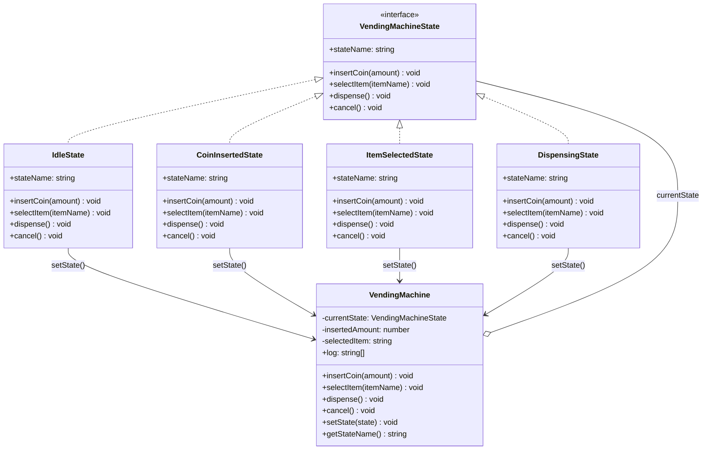

# State 패턴

**분류**: Behavioral (행동 패턴)

---

## 의도 (Intent)

객체의 내부 상태가 변경될 때 객체의 행동도 변경되도록 한다. 마치 객체의 클래스가 바뀐 것처럼 보인다.

---

## 핵심 개념 설명

State 패턴의 핵심은 **상태별로 다른 동작을 if/else 없이 구현**하는 것이다.

State 패턴 없이 자판기를 구현하면:
```typescript
// 나쁜 예: 상태마다 if/else가 증가한다
insertCoin() {
  if (state === 'idle') { ... }
  else if (state === 'coinInserted') { ... }
  else if (state === 'dispensing') { ... }
}
```

State 패턴을 쓰면 각 상태가 자신의 행동을 캡슐화한다:
```typescript
// 좋은 예: 현재 상태 객체에 위임
insertCoin() {
  this.currentState.insertCoin() // 상태 객체가 알아서 처리
}
```

상태 전이(transition)도 State 객체 내부에 있어서, 어떤 상태에서 어떤 상태로 가는지가 분산되지 않고 각 State 클래스에 명확히 정의된다.

이 예시에서는 대기 → 동전투입 → 상품선택 → 배출 → 대기 흐름을 가진 자판기를 구현했다.

---

## 구조 다이어그램



---

## 실무 사용 사례

| 상황 | 설명 |
|------|------|
| **주문 상태 관리** | 주문생성 → 결제완료 → 배송중 → 배송완료 → 반품 |
| **TCP 연결** | CLOSED → LISTEN → SYN_RECEIVED → ESTABLISHED 전이 |
| **미디어 플레이어** | 정지 → 재생 → 일시정지 → 정지 상태별 버튼 동작 변경 |
| **게임 캐릭터** | 일반 → 슈퍼 → 무적 상태별 피격/이동 동작 차이 |
| **문서 워크플로우** | 초안 → 검토중 → 승인됨 → 게시됨 상태 전이 |

---

## 장단점

### 장점
- **단일 책임 원칙**: 각 상태의 동작이 해당 State 클래스에만 정의된다.
- **개방-폐쇄 원칙**: 새 상태 추가 시 기존 상태 클래스를 수정하지 않아도 된다.
- **조건문 제거**: 상태마다 중복되는 if/else가 사라진다.
- **상태 전이 명확화**: 어떤 상태에서 어떤 상태로 가는지가 코드에 명확히 드러난다.

### 단점
- **클래스 수 증가**: 상태 하나마다 클래스가 하나씩 필요하다.
- **상태가 적으면 과설계**: 상태가 2~3개뿐이라면 단순 if/else가 더 간단할 수 있다.
- **Context 노출**: State가 Context의 내부 메서드를 호출해야 하므로 Context가 일부 내부를 공개해야 한다.

---

## 관련 패턴

- **Strategy**: State는 상태 전이가 있어 스스로 Context의 상태를 바꾸지만, Strategy는 Context가 전략을 교체하며 전이 개념이 없다.
- **Singleton**: 상태 객체는 공유 가능한 경우가 많아 Singleton으로 구현하면 메모리를 절약할 수 있다.
- **Command**: 명령 실행 결과로 상태 전이가 발생하는 시스템에서 두 패턴이 함께 사용된다.

## Vue 구현

### Vue에서 이 패턴이 어떻게 표현되는가

Vue에서 State는 **`ref`에 현재 상태명을 저장하고, 상태별 동작 맵으로 전이를 제어**하는 방식으로 구현한다.

```ts
type StateName = 'idle' | 'coinInserted' | 'itemSelected' | 'dispensing'
const currentState = ref<StateName>('idle')  // Context

// ConcreteState 맵
const states = {
  idle: {
    insertCoin(amount: number) {
      machine.insertedAmount += amount
      currentState.value = 'coinInserted'  // 상태 전이
    },
    selectItem() { addLog('오류: 먼저 동전을 투입해주세요.') },
  },
  coinInserted: { ... },
  // ...
}

// 현재 상태에서 가능한 동작만 버튼 활성화
const canInsertCoin = computed(() => ['idle', 'coinInserted'].includes(currentState.value))
```

### TS 구현과의 차이점

| TypeScript | Vue |
|---|---|
| 상태별 클래스 (`IdleState` 등) | 상태명을 key로 하는 객체 맵 |
| `context.setState(new IdleState())` | `currentState.value = 'idle'` |
| 상태 객체가 직접 전이 제어 | 상태 맵 함수 내부에서 ref 변경 |
| 다형성으로 동작 분기 | 객체 맵 조회로 동작 분기 |

### 사용된 Vue 개념

- **`ref()`**: 현재 상태명을 반응형으로 저장, 교체가 곧 상태 전이
- **`computed()`**: 현재 상태에서 활성화된 버튼을 자동 계산 (상태 머신 시각화)
- **`reactive()`**: 자판기 내부 데이터(금액, 선택 상품) 반응형 관리
- **객체 맵**: 클래스 상속 없이 상태별 동작을 데이터로 표현

## React 구현

### React에서 이 패턴이 어떻게 표현되는가

`useReducer` 기반 상태 머신이 State 패턴을 구현한다.

```
useReducer(machineReducer, INITIAL_STATE)
  ├─ machineReducer(state, action)     ← 각 ConcreteState의 메서드들
  │   ├─ case '대기 중' + INSERT_COIN  → IdleState.insertCoin()
  │   ├─ case '동전 투입됨' + SELECT   → CoinInsertedState.selectItem()
  │   └─ ...
  └─ ALLOWED_ACTIONS                   ← 상태별 허용 액션 선언

dispatch({ type: 'INSERT_COIN', amount: 500 })  ← context.insertCoin(500)
```

- TS에서 각 `ConcreteState`가 `context.setState()`를 직접 호출해 전이했던 것과 달리, React에서는 `reducer`가 다음 상태를 결정해 반환한다.
- `ALLOWED_ACTIONS` 테이블이 각 상태에서 허용되는 액션을 선언적으로 정의한다 — TS의 각 ConcreteState 메서드 안의 검증 로직이 한 곳에 집중됨.

### TS 구현과의 차이점

| TS 구현 | React 구현 |
|---|---|
| `class IdleState implements VendingMachineState` | `reducer`의 `case '대기 중'` 분기 |
| `context.setState(new CoinInsertedState())` | `return { ...state, stateName: '동전 투입됨' }` |
| 상태 클래스가 전이를 제어 | reducer가 전이를 결정 |

### 사용된 React 개념

- `useReducer`: 복잡한 상태 전이 로직을 reducer로 중앙화
- 상태 머신 패턴: 현재 상태 + 액션 → 다음 상태
- `ALLOWED_ACTIONS` 테이블: 선언적 상태 검증

---

## Svelte 구현

### Svelte에서 이 패턴이 어떻게 표현되는가?

Svelte 5에서는 **`$state currentState`** 가 현재 상태명을 저장하고, **`$derived`** 가 현재 상태에 따른 허용 액션과 UI 설정을 자동 계산한다. 상태 전이는 `currentState = 'coin_inserted'` 같은 단순 대입으로 구현된다.

```svelte
<script lang="ts">
  type MachineState = 'idle' | 'coin_inserted' | 'item_selected' | 'dispensing'
  let currentState = $state<MachineState>('idle')

  // $derived: 현재 상태의 허용 액션 자동 계산 (ConcreteState 로직)
  let canInsertCoin = $derived(currentState === 'idle' || currentState === 'coin_inserted')
  let canSelectItem = $derived(currentState === 'coin_inserted')

  function insertCoin(amount: number) {
    if (!canInsertCoin) return
    insertedAmount += amount
    currentState = 'coin_inserted'  // 상태 전이
  }
</script>
```

### TS 구현과의 차이점

| TypeScript | Svelte 5 |
|-----------|---------|
| 각 상태를 별도 클래스로 구현 | 문자열 유니온 타입으로 상태 표현 |
| `machine.setState(new IdleState())` | `currentState = 'idle'` 단순 대입 |
| 상태 클래스 내부에 전이 로직 캡슐화 | 각 액션 함수가 상태 전이 담당 |
| 다형성으로 동작 분기 | `$derived`로 허용 액션 자동 분기 |

### 사용된 Svelte 5 개념

- **`$state`**: 현재 상태명, 투입금액, 선택 상품을 반응형으로 관리
- **`$derived`**: 각 상태의 허용 액션 자동 계산 (버튼 활성/비활성)
- **문자열 유니온 타입**: 안전한 상태 표현 (TypeScript 지원)
