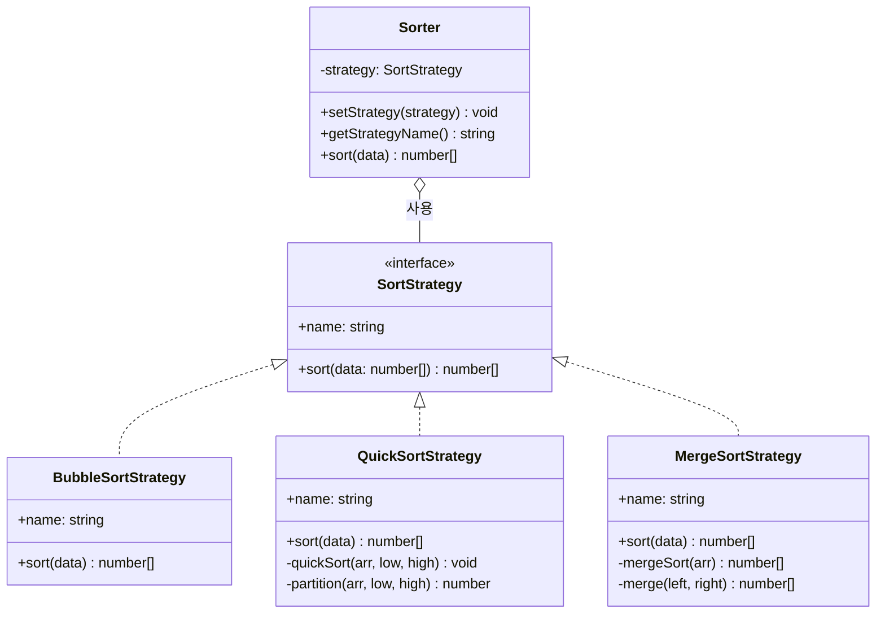

# Strategy 패턴

**분류**: Behavioral (행동 패턴)

---

## 의도 (Intent)

알고리즘 군(family)을 정의하고, 각각을 캡슐화해 교환 가능하게 만든다. Strategy 패턴을 사용하면 알고리즘을 사용하는 클라이언트와 독립적으로 알고리즘을 변경할 수 있다.

---

## 핵심 개념 설명

Strategy 패턴의 핵심은 **"무엇을 하는가"와 "어떻게 하는가"를 분리**하는 것이다.

예를 들어 정렬이 필요하다는 사실(무엇)은 Context가 알고, 버블/퀵/머지 중 어떤 알고리즘(어떻게)을 쓸지는 Strategy 객체가 결정한다.

이렇게 하면:
- Context 코드에 `if (type === 'bubble') ... else if (type === 'quick') ...` 같은 분기가 사라진다.
- 새 알고리즘을 추가할 때 기존 코드를 건드리지 않고 새 Strategy 클래스만 만들면 된다.
- 런타임에 알고리즘을 교체할 수 있다.

이 예시에서는 `Sorter`(Context)가 세 가지 정렬 전략을 교체하며 사용하는 시스템을 구현했다.

---

## 구조 다이어그램



---

## 실무 사용 사례

| 상황 | 설명 |
|------|------|
| **결제 처리** | 신용카드, 페이팔, 암호화폐 등 결제 방식을 Strategy로 교체 |
| **압축 알고리즘** | ZIP, GZIP, BZIP 등을 상황에 맞게 선택 |
| **경로 탐색** | 자동차, 도보, 대중교통 경로 알고리즘 교체 |
| **유효성 검사** | 폼 필드마다 다른 검증 규칙(Strategy)을 주입 |

---

## 장단점

### 장점
- **조건문 제거**: if/else나 switch로 알고리즘을 선택하는 코드가 사라진다.
- **개방-폐쇄 원칙(OCP)**: 새 알고리즘 추가 시 기존 코드 수정 불필요.
- **테스트 용이**: 각 Strategy를 독립적으로 단위 테스트할 수 있다.
- **런타임 교체**: 실행 중에 동작 방식을 동적으로 변경할 수 있다.

### 단점
- **클래스 수 증가**: 알고리즘 하나마다 클래스가 하나씩 늘어난다.
- **클라이언트가 전략을 알아야 함**: 어떤 Strategy를 선택할지는 클라이언트가 결정해야 한다.
- **간단한 경우 과설계**: 알고리즘이 2~3개이고 바뀔 일이 없다면 오히려 복잡해진다.

---

## 관련 패턴

- **Template Method**: Strategy가 위임(composition)으로 알고리즘을 교체한다면, Template Method는 상속으로 알고리즘의 일부를 교체한다.
- **Decorator**: Strategy는 알고리즘 전체를 교체하고, Decorator는 기존 동작에 기능을 덧붙인다.
- **Command**: 둘 다 행동을 캡슐화하지만, Command는 실행 취소(undo)와 이력 관리에 초점을 둔다.

## Vue 구현

### Vue에서 이 패턴이 어떻게 표현되는가

Vue에서 Strategy는 **`ref`에 저장된 전략 함수**로 구현한다. ref를 교체하는 것이 전략 교체다.

```ts
// 전략 함수들 (ConcreteStrategy)
const bubbleSort: SortStrategy = { name: '버블 정렬', sort: (data) => { ... } }
const quickSort: SortStrategy  = { name: '퀵 정렬',  sort: (data) => { ... } }

// Context: ref에 현재 전략 저장
const currentStrategy = ref<SortStrategy>(quickSort)

// computed: 전략 교체 시 자동으로 재계산 (Context.sort()와 동일)
const sortedData = computed(() => currentStrategy.value.sort(inputData.value))

// 전략 교체 (setStrategy()와 동일)
currentStrategy.value = bubbleSort  // → sortedData가 자동 재계산
```

### TS 구현과의 차이점

| TypeScript | Vue |
|---|---|
| `Sorter` 클래스 (Context) | `currentStrategy` ref + `computed` |
| `setStrategy(strategy)` | `currentStrategy.value = strategy` |
| `sort()` 메서드 | `computed(sortedData)` |
| 명시적 `sort()` 호출 | 전략 교체 시 `computed` 자동 재계산 |

### 사용된 Vue 개념

- **`ref()`**: 전략 함수를 교체 가능한 반응형 값으로 저장
- **`computed()`**: 전략이 바뀔 때마다 자동으로 재계산되는 Context.sort() 구현
- **함수 타입**: 클래스 상속 대신 인터페이스를 만족하는 객체 리터럴로 전략 표현

## React 구현

### React에서 이 패턴이 어떻게 표현되는가

함수 자체가 전략이 되고, `useSorter()` 훅이 Context 역할을 한다.

```
useSorter()                      ← Context (Sorter)
  ├─ currentStrategy: SortStrategy  ← 현재 전략 (useState)
  ├─ setStrategy(s)              ← Sorter.setStrategy()
  └─ sort(data)                  ← strategy.sort(data)에 위임

bubbleSortStrategy               ← ConcreteStrategy 1
quickSortStrategy                ← ConcreteStrategy 2
mergeSortStrategy                ← ConcreteStrategy 3
nativeSortStrategy               ← ConcreteStrategy 4
```

- TS에서 `new BubbleSortStrategy()` 클래스 인스턴스였던 전략이 React에서는 객체 리터럴(함수 포함)이다.
- `setStrategy(bubbleSortStrategy)` 한 줄로 런타임에 알고리즘을 교체한다.
- `sort()` 함수는 전략이 바뀌어도 변경되지 않는다 — Context의 핵심.

### TS 구현과의 차이점

| TS 구현 | React 구현 |
|---|---|
| `class BubbleSortStrategy implements SortStrategy` | `bubbleSortStrategy: SortStrategy` 객체 |
| `sorter.setStrategy(new QuickSortStrategy())` | `setStrategy(quickSortStrategy)` |
| `class Sorter` 클래스 | `useSorter()` 커스텀 훅 |

### 사용된 React 개념

- `useState`: 현재 전략을 상태로 관리 (교체 시 리렌더링 트리거)
- 함수를 값으로: 전략이 함수를 포함한 객체 리터럴로 표현됨
- `useCallback`: Context 메서드 메모이제이션

---

## Svelte 구현

### Svelte에서 이 패턴이 어떻게 표현되는가?

Svelte 5에서는 **전략 함수 자체를 `$state`로 관리**하고, **`$derived`** 가 전략이 바뀔 때마다 자동으로 재실행한다. TypeScript에서 `sorter.setStrategy()` 후 `sorter.sort()`를 명시 호출하던 것이, `$state` 변경 하나로 `$derived` 재계산까지 자동으로 이어진다.

```svelte
<script lang="ts">
  let selectedStrategyId = $state('quick')

  let currentStrategy = $derived(strategies.find(s => s.id === selectedStrategyId)!)

  // 전략 교체 시 자동 재정렬 — setStrategy() + sort() 자동 실행
  let sortedData = $derived(currentStrategy.fn(parsedData))
</script>
```

### TS 구현과의 차이점

| TypeScript | Svelte 5 |
|-----------|---------|
| `Sorter` 클래스에 `setStrategy()` 주입 | `$state`로 전략 ID 관리 |
| `sorter.sort(data)` 명시 호출 | `$derived`로 자동 재정렬 |
| 인터페이스 `SortStrategy` | 함수 타입으로 전략 표현 |

### 사용된 Svelte 5 개념

- **`$state`**: 현재 전략 ID를 반응형으로 관리
- **`$derived`**: 전략 교체나 데이터 변경 시 자동으로 결과 재계산
- **시각화**: 막대 그래프로 정렬 전/후를 즉시 비교
