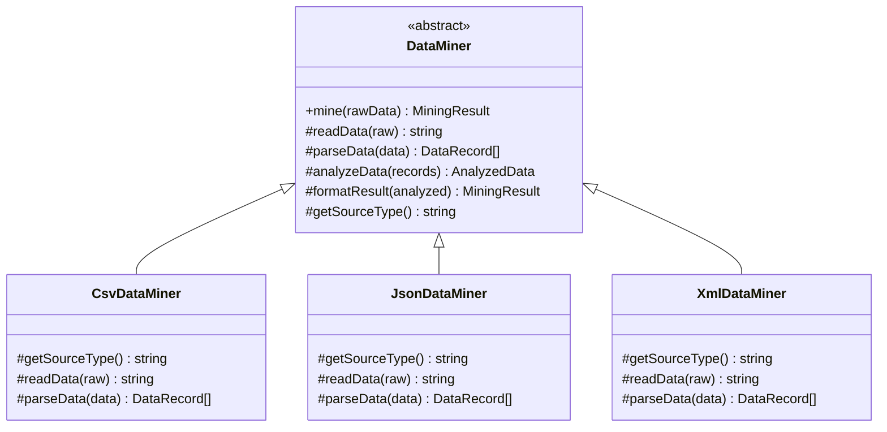

# Template Method 패턴

**분류**: Behavioral (행동 패턴)

---

## 의도 (Intent)

알고리즘의 골격(skeleton)을 부모 클래스에 정의하고, 일부 단계의 구현을 서브클래스로 미룬다. 서브클래스는 알고리즘의 구조를 바꾸지 않고 특정 단계만 재정의할 수 있다.

---

## 핵심 개념 설명

Template Method 패턴의 핵심은 **"공통 흐름은 부모, 다른 부분만 자식"** 이다.

데이터 마이닝 예시로 설명하면:
- CSV, JSON, XML 파서 모두 **같은 순서**로 동작한다: 읽기 → 파싱 → 분석 → 반환
- 하지만 **파싱하는 방법**은 포맷마다 다르다.
- Template Method는 공통 순서를 `mine()`(템플릿 메서드)에 정의하고, 파싱만 서브클래스가 구현한다.

두 종류의 메서드가 있다:
- **추상 메서드(abstract)**: 서브클래스가 반드시 구현해야 한다. 포맷마다 다른 `parseData()`가 여기 해당.
- **훅 메서드(hook)**: 기본 구현이 있지만 필요하면 오버라이드할 수 있다. `analyzeData()`가 여기 해당.

이 예시에서는 CSV, JSON, XML 세 포맷의 데이터 마이너가 동일한 처리 흐름을 공유하는 시스템을 구현했다.

---

## 구조 다이어그램



---

## 실무 사용 사례

| 상황 | 설명 |
|------|------|
| **프레임워크 생명주기** | React의 `componentDidMount`, Angular의 `ngOnInit` 등 훅 메서드 |
| **테스트 픽스처** | JUnit의 `setUp()`/`tearDown()` — 테스트 프레임워크가 실행 순서를 강제 |
| **문서 변환기** | Word, PDF, HTML 변환기가 동일한 파이프라인(읽기→변환→저장)을 공유 |
| **게임 AI** | 모든 적 AI가 동일한 순서(감지→판단→행동)로 동작하되 행동만 다름 |
| **데이터 파이프라인** | ETL(Extract→Transform→Load)에서 각 단계만 구현체마다 다름 |

---

## 장단점

### 장점
- **코드 중복 제거**: 공통 흐름을 부모 클래스 한 곳에 정의해 중복을 없앤다.
- **제어의 역전**: 부모가 언제 서브클래스 메서드를 호출할지 결정한다(Hollywood 원칙: "Don't call us, we'll call you").
- **확장 지점 명확화**: 오버라이드해야 할 메서드가 명확히 드러난다.

### 단점
- **리스코프 치환 원칙 위반 위험**: 서브클래스가 부모의 계약을 깨는 방식으로 오버라이드할 수 있다.
- **상속의 한계**: 컴포지션보다 결합도가 높다. 서브클래스는 항상 부모에 묶인다.
- **골격 변경 시 파급 효과**: 템플릿 메서드(mine())의 순서를 바꾸면 모든 서브클래스에 영향을 준다.

---

## 관련 패턴

- **Strategy**: Template Method는 상속으로 알고리즘 일부를 교체하고, Strategy는 컴포지션으로 전체 알고리즘을 교체한다. "상속 vs 컴포지션"의 대표적인 대비 사례.
- **Factory Method**: Template Method의 특수한 경우로, 객체 생성 단계 하나를 서브클래스가 결정하도록 하는 패턴.
- **Hook**: Template Method 내에서 선택적으로 오버라이드 가능한 메서드를 훅(Hook)이라고 부른다. 프레임워크 설계의 핵심 개념.

## Vue 구현

### Vue에서 이 패턴이 어떻게 표현되는가

Vue에서 Template Method는 **골격 composable + 구현 함수 주입** 방식으로 구현한다. 추상 클래스 상속 대신 config 객체로 구현을 주입한다.

```ts
// AbstractClass — 골격 composable
function useDataMiner(config: {
  sourceName: string
  readData: (raw: string) => string     // 추상 메서드
  parseData: (data: string) => DataRecord[]  // 추상 메서드
  analyzeData?: (records: DataRecord[]) => AnalyzedData  // Hook 메서드
}) {
  async function mine(rawData: string) {
    const data = config.readData(rawData)      // 1단계
    const records = config.parseData(data)     // 2단계
    const analyze = config.analyzeData ?? defaultAnalyze
    const analyzed = analyze(records)          // 3단계 (hook)
    return formatResult(analyzed)              // 4단계
  }
  return { mine }
}

// ConcreteClass — 구현 주입
const csvMiner = useDataMiner({
  sourceName: 'CSV',
  readData: (raw) => raw.trim(),
  parseData: (data) => { /* CSV 파싱 */ },
})
```

### TS 구현과의 차이점

| TypeScript | Vue |
|---|---|
| 추상 클래스 상속 | config 객체 주입 |
| `abstract readData()` | config.readData 필수 함수 |
| Hook 메서드 기본 구현 | `config.analyzeData ?? defaultAnalyze` |
| `extends DataMiner` | `useDataMiner({ readData, parseData })` |

### 사용된 Vue 개념

- **composable 합성**: 골격 composable이 알고리즘 순서를 정의하고 구체 함수를 config로 받음
- **함수 주입**: 추상 메서드를 클래스 상속 없이 함수 인자로 구현
- **`ref()`**: 실행 중 상태(`isRunning`)와 결과(`result`)를 반응형으로 관리

## React 구현

### React에서 이 패턴이 어떻게 표현되는가

`useDataFetcher(config)` 훅이 알고리즘 골격을 정의하고, `config` 객체로 가변 부분을 주입받는다.

```
useDataFetcher(config)           ← AbstractClass (DataMiner)
  process(rawData):
    1. config.readData(rawData)  ← 추상 메서드 (반드시 제공)
    2. config.parseData(data)    ← 추상 메서드 (반드시 제공)
    3. config.analyzeData?(recs) ← hook 메서드 (선택적, 기본값 있음)
    4. formatResult(analyzed)    ← 고정된 공통 로직

csvConfig   = { readData, parseData }  ← CsvDataMiner
jsonConfig  = { readData, parseData }  ← JsonDataMiner
xmlConfig   = { readData, parseData, analyzeData }  ← XmlDataMiner (hook 오버라이드)
```

- TS의 서브클래스 상속 대신 **설정 객체 주입(config injection)** 으로 가변 부분을 교체한다.
- `config.analyzeData`가 제공되지 않으면 기본 구현(`defaultAnalyze`)이 실행된다 — hook 메서드의 동작과 동일.
- 알고리즘 순서(골격)는 `process()` 함수 내에 고정되어 있고, 어떤 `config`를 넣어도 순서는 변하지 않는다.

### TS 구현과의 차이점

| TS 구현 | React 구현 |
|---|---|
| `abstract class DataMiner` + 서브클래스 상속 | `useDataFetcher(config)` + 설정 객체 주입 |
| `protected abstract parseData()` 추상 메서드 | `config.parseData` 필수 함수 |
| `protected analyzeData()` hook (오버라이드 가능) | `config.analyzeData?` 선택적 함수 |

### 사용된 React 개념

- 커스텀 훅 + 설정 주입: 상속 대신 조합(composition)으로 가변 부분 교체
- `useCallback`: `process` 함수 메모이제이션
- `useState`: 처리 결과 + 에러 + 로딩 상태 관리

---

## Svelte 구현

### Svelte에서 이 패턴이 어떻게 표현되는가?

Svelte 5에서는 각 Miner를 **단계별 함수를 가진 객체 리터럴**로 표현하고, 공통 `mine()` 함수가 골격(순서)을 제어한다. **`$derived`** 가 Miner나 입력 데이터가 바뀔 때마다 `mine()`을 자동으로 재실행한다.

```svelte
<script lang="ts">
  // AbstractClass 역할: 공통 골격 함수
  function mine(config: DataMinerConfig, rawData: string) {
    const data = config.readData(rawData)    // 추상 메서드
    const records = config.parseData(data)  // 추상 메서드
    const analyzed = analyzeData(records)   // hook (공통)
    return formatResult(analyzed)           // 공통
  }

  // ConcreteClass: 단계 함수를 가진 객체
  const csvMiner = { readData: raw => raw.trim(), parseData: ... }

  let selectedMinerId = $state('csv')
  let currentMiner = $derived(miners.find(m => m.id === selectedMinerId)!)

  // Miner/데이터 변경 시 자동 재실행
  let result = $derived(mine(currentMiner, rawInput))
</script>
```

### TS 구현과의 차이점

| TypeScript | Svelte 5 |
|-----------|---------|
| 추상 클래스 `DataMiner` 상속 | 인터페이스 타입 + 객체 리터럴 |
| `abstract parseData()` 오버라이드 | 객체의 `parseData` 함수 속성 |
| `miner.mine(data)` 수동 호출 | `$derived`로 자동 재실행 |

### 사용된 Svelte 5 개념

- **`$state`**: 선택된 ConcreteClass와 입력 데이터를 반응형으로 관리
- **`$derived`**: Miner 교체나 입력 변경 시 `mine()` 자동 재실행
- **`$effect`**: Miner 변경 시 샘플 데이터 자동 로드
