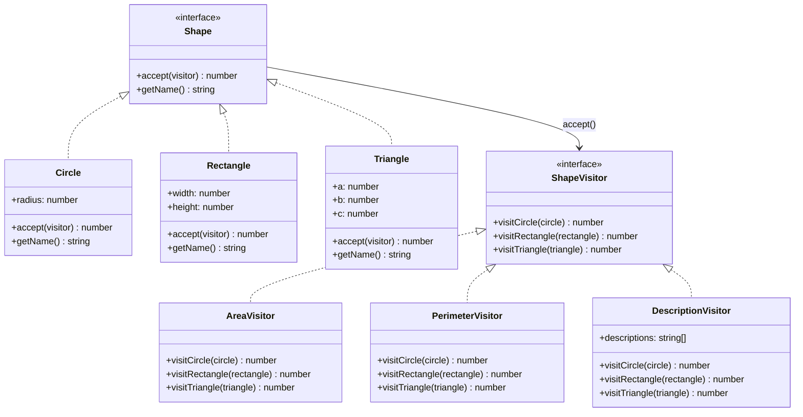

# Visitor 패턴

**분류**: Behavioral (행동 패턴)

---

## 의도 (Intent)

객체 구조를 변경하지 않고 새로운 연산(동작)을 추가할 수 있게 한다.
연산 로직을 별도의 Visitor 클래스로 분리해, 개방/폐쇄 원칙을 지키면서 기능을 확장한다.

---

## 핵심 개념 설명

### 문제: 기존 클래스에 새 연산 추가

도형 클래스(`Circle`, `Rectangle`)에 면적 계산을 추가하는 것은 쉽다.
하지만 둘레 계산, SVG 렌더링, JSON 직렬화... 연산이 늘어날수록 도형 클래스가 비대해진다.
그리고 새 연산을 추가할 때마다 모든 도형 클래스를 수정해야 한다.

### 해결: Double Dispatch

Visitor 패턴은 **두 번의 동적 디스패치**로 "어떤 Element에 어떤 연산을?"을 런타임에 결정한다.

```
1단계: shape.accept(visitor)
       → shape가 Circle이면 → visitor.visitCircle(this) 호출
       → shape가 Rectangle이면 → visitor.visitRectangle(this) 호출

2단계: visitor.visitCircle(circle)
       → visitor가 AreaVisitor이면 → π × r² 계산
       → visitor가 PerimeterVisitor이면 → 2πr 계산
```

이 두 번의 바인딩 덕분에 `(Element 타입, Visitor 타입)` 조합에 맞는 정확한 메서드가 선택된다.

### 연산 추가 비교

| 방법 | 새 연산 추가 | 새 Element 추가 |
|------|-------------|----------------|
| 기존 클래스에 직접 | 모든 클래스 수정 필요 | 쉬움 |
| **Visitor 패턴** | **새 Visitor 클래스만 추가** | Visitor 인터페이스 수정 필요 |

---

## 구조 다이어그램



---

## 실무 사용 사례

| 사례 | 설명 |
|------|------|
| **컴파일러 AST 처리** | 타입 검사, 코드 생성, 최적화를 각각 Visitor로 구현한다 |
| **문서 내보내기** | 같은 문서 구조를 PDF, HTML, Markdown으로 내보낼 때 |
| **직렬화** | 객체 그래프를 JSON, XML, Binary로 변환할 때 |
| **UI 렌더러** | 같은 컴포넌트 트리를 SVG, Canvas, DOM으로 렌더링할 때 |
| **세금 계산기** | 다양한 상품 타입에 대해 여러 세금 규칙을 적용할 때 |

---

## 장단점

### 장점

- **개방/폐쇄 원칙**: 기존 Element 클래스를 수정하지 않고 새 Visitor(연산)를 추가할 수 있다.
- **관련 로직 집중**: 하나의 연산에 관련된 코드가 Visitor 클래스 하나에 모인다.
- **상태 축적 가능**: Visitor가 순회하면서 결과를 자신의 필드에 누적할 수 있다 (`DescriptionVisitor` 참조).

### 단점

- **새 Element 추가 어려움**: 새 Element 타입이 생기면 모든 Visitor에 새 메서드를 추가해야 한다.
- **캡슐화 약화**: Visitor가 Element의 내부 상태에 접근해야 하므로, Element가 내부를 노출해야 할 수 있다.
- **복잡성**: 패턴이 낯선 팀원에게는 double dispatch 개념이 처음에 이해하기 어려울 수 있다.

---

## 관련 패턴

- **Composite**: Visitor는 Composite 트리를 순회하면서 각 노드에 연산을 적용하는 데 자주 사용된다.
- **Iterator**: Iterator로 컬렉션을 순회하면서 각 요소에 Visitor를 적용하는 조합이 흔하다.
- **Command**: 둘 다 연산을 객체로 캡슐화하지만, Command는 실행 취소에 초점을 두고 Visitor는 구조 순회에 초점을 둔다.
- **Strategy**: Strategy는 알고리즘 전체를 교체하지만, Visitor는 객체 구조를 순회하며 타입별로 다른 처리를 한다.
