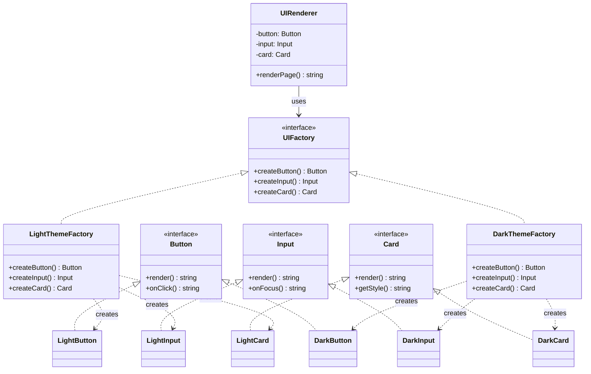

# Abstract Factory — 추상 팩토리 패턴

**분류**: Creational (생성 패턴)

---

## 의도 (Intent)

**서로 관련된 객체들의 집합(제품군)**을 생성하기 위한 인터페이스를 제공하되, 구체적인 클래스를 지정하지 않는다. 같은 팩토리에서 나온 제품들은 항상 서로 어울린다.

### 어떤 문제를 해결하는가?

- UI 테마처럼 "Button, Input, Card가 모두 라이트 테마 또는 모두 다크 테마"여야 할 때, 개별적으로 생성하면 실수로 라이트 버튼과 다크 카드를 섞을 수 있다.
- Abstract Factory는 한 팩토리에서 모든 컴포넌트를 만들도록 강제해 **일관성을 보장**한다.
- 클라이언트는 팩토리 인터페이스만 알고, 어떤 구체 팩토리를 주입하느냐에 따라 전혀 다른 제품군이 생성된다.

### Factory Method와의 차이

| | Factory Method | Abstract Factory |
|---|---|---|
| 생성 대상 | 하나의 Product | 여러 관련 Product (제품군) |
| 구조 | 메서드 하나를 서브클래스가 오버라이드 | 팩토리 자체를 교체 (주입) |
| 관심사 | "어떤 클래스를 만들지" | "어떤 패밀리의 제품군을 만들지" |

---

## 핵심 개념

### 제품군 (Product Family)

서로 함께 써야 하는 객체들의 집합. 이 예시에서는 `{Button, Input, Card}`가 하나의 제품군이다. 라이트 테마 팩토리는 라이트 버전 세트를, 다크 테마 팩토리는 다크 버전 세트를 만든다.

### 팩토리 교체로 전체 테마 변경

클라이언트(`UIRenderer`)는 `UIFactory` 인터페이스만 안다. `LightThemeFactory`를 `DarkThemeFactory`로 교체하면 클라이언트 코드 한 줄도 바꾸지 않고 전체 UI 테마가 바뀐다.

---

## 구조 다이어그램

---

## 실무 사용 사례

| 사례 | 설명 |
|------|------|
| **UI 테마 시스템** | 라이트/다크 테마의 모든 컴포넌트를 일관되게 교체 |
| **크로스 플랫폼 UI** | iOS/Android/Web별 네이티브 컴포넌트 세트 생성 |
| **데이터베이스 추상화** | PostgreSQL/MySQL별 Connection, Query, Transaction 객체 생성 |
| **렌더링 엔진** | OpenGL/Vulkan/DirectX별 Buffer, Shader, Pipeline 객체 생성 |
| **테스트 환경** | 실제 DB 대신 인메모리 Repository 세트를 주입하는 테스트 팩토리 |

---

## 장단점

### 장점

- **제품군 일관성 보장**: 같은 팩토리에서 만든 객체들은 항상 서로 호환된다.
- **구체 클래스 은닉**: 클라이언트는 인터페이스만 알고 구현체를 모른다.
- **팩토리 교체 = 전체 교체**: 팩토리 하나를 교체해 전체 동작 방식을 바꿀 수 있다.

### 단점

- **새 Product 타입 추가 어려움**: 팩토리 인터페이스에 메서드를 추가하면 **모든 ConcreteFactory**를 수정해야 한다.
- **클래스 수 폭발**: 제품 유형 × 팩토리 수만큼 클래스가 생긴다.

---

## 관련 패턴

- **Factory Method**: Abstract Factory의 메서드들이 내부적으로 Factory Method로 구현되는 경우가 많다.
- **Singleton**: 팩토리 자체가 Singleton으로 만들어지는 경우가 많다.
- **Prototype**: ConcreteFactory가 프로토타입 객체를 복제해 제품을 만드는 방식으로 구현할 수 있다.
- **Builder**: Abstract Factory가 "무엇을 만드는지"에 집중한다면, Builder는 "어떻게 단계별로 만드는지"에 집중한다.
