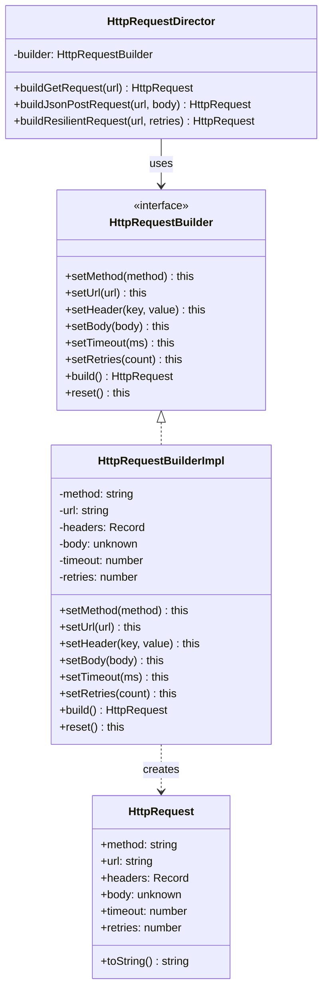

# Builder — 빌더 패턴

**분류**: Creational (생성 패턴)

---

## 의도 (Intent)

복잡한 객체의 **생성 과정을 단계별로 분리**해, 동일한 생성 절차로 서로 다른 표현(결과물)을 만들 수 있게 한다.

### 어떤 문제를 해결하는가?

생성자에 매개변수가 너무 많으면 코드가 읽기 어려워지는 **Telescoping Constructor(우주선 생성자) 문제**가 발생한다.

```typescript
// 나쁜 예: 어떤 값이 어떤 의미인지 알 수 없다
new HttpRequest('GET', 'https://...', {}, null, 5000, 3)

// Builder를 쓰면 각 단계가 명확하다
new HttpRequestBuilderImpl()
  .setMethod('GET')
  .setUrl('https://...')
  .setTimeout(5000)
  .setRetries(3)
  .build()
```

또한, 객체를 단계별로 조건부로 구성해야 할 때(어떤 경우엔 body가 있고, 어떤 경우엔 없는 등) Builder가 유용하다.

---

## 핵심 개념

### 메서드 체이닝 (Fluent Interface)

각 설정 메서드가 `this`를 반환하므로 `.setX().setY().setZ().build()` 형태로 연결할 수 있다. 가독성이 높아지고 순서를 자유롭게 정할 수 있다.

### Director의 역할

Director는 자주 쓰는 빌드 순서를 미리 정의한다. 클라이언트가 매번 올바른 순서와 조합을 기억할 필요 없이 Director가 보장해준다. Director 없이 Builder를 직접 써도 되지만, 공통 패턴을 재사용할 때 유용하다.

### build() 시점의 검증

객체 생성 완료 시점에 필수 값이 있는지 검증한다. 일부 값만 설정된 채 미완성 객체가 만들어지는 것을 방지한다.

---

## 구조 다이어그램



---

## 실무 사용 사례

| 사례 | 설명 |
|------|------|
| **HTTP 클라이언트** | `axios`, `fetch` 래퍼에서 메서드, 헤더, 바디 등을 단계별로 설정 |
| **SQL 쿼리 빌더** | `SELECT`, `WHERE`, `JOIN`, `ORDER BY` 등을 체이닝으로 조합 |
| **이메일 발송** | 제목, 수신자, 첨부파일, 템플릿을 단계별로 설정 |
| **테스트 픽스처** | 테스트용 객체를 가독성 좋게 생성 (`UserBuilder.create().withRole('admin').build()`) |
| **문서/보고서 생성** | 헤더, 섹션, 푸터를 순서대로 조립해 완성 |

---

## 장단점

### 장점

- **가독성**: 각 설정 단계에 이름이 있어 코드를 읽기 쉽다.
- **유연성**: 필요한 설정만 골라서 할 수 있고, 선택적 필드를 자연스럽게 처리한다.
- **불변 객체 생성**: `build()` 이후 반환된 객체는 변경 불가능하게 만들 수 있다.
- **검증 집중화**: `build()` 한 곳에서 모든 유효성 검사를 처리한다.

### 단점

- **코드량 증가**: Product 클래스 외에 Builder 인터페이스와 구현체가 추가된다.
- **Director 필요성 모호**: 간단한 경우엔 Director가 오히려 불필요한 레이어가 된다.
- **필드 동기화**: Product와 Builder가 같은 필드를 공유하므로 하나에 필드를 추가하면 다른 쪽도 수정해야 한다.

---

## 관련 패턴

- **Abstract Factory**: Abstract Factory가 "제품군의 종류"를 결정한다면, Builder는 "한 제품의 구성 단계"를 정의한다.
- **Composite**: Builder로 복잡한 Composite 트리를 단계별로 조립할 수 있다.
- **Fluent Interface**: Builder에 메서드 체이닝을 적용한 스타일. 같은 개념이 아니지만 함께 쓰인다.

## Vue 구현

### Vue에서 이 패턴이 어떻게 표현되는가

Vue에서 Builder는 **reactive 상태 + 체이닝 메서드를 가진 composable**로 구현한다.

```ts
function useRequestBuilder() {
  const state = reactive<HttpRequest>({ method: 'GET', url: '', ... })

  function setMethod(method: string) { state.method = method; return builder }
  function setUrl(url: string) { state.url = url; return builder }
  function build(): HttpRequest { return { ...state } }

  const builder = { state, setMethod, setUrl, build, reset }
  return builder
}
```

`computed`로 빌드 미리보기를 실시간 반영하고, 프리셋 함수들이 Director 역할을 한다.

### TS 구현과의 차이점

| TypeScript | Vue |
|---|---|
| `HttpRequestBuilderImpl` 클래스 | `useRequestBuilder()` composable |
| private 필드 | `reactive` 내부 상태 |
| `HttpRequestDirector` 클래스 | 프리셋 함수들 |
| 반환된 `HttpRequest` 객체 | `build()`가 반환하는 plain 객체 |

### 사용된 Vue 개념

- **`reactive()`**: 빌더 내부 상태를 반응형으로 관리해 실시간 미리보기 가능
- **`computed()`**: 빌더 상태 변경 시 미리보기가 자동으로 재계산됨
- **메서드 체이닝**: 각 setter가 `builder`를 반환해 `.setMethod().setUrl().build()` 체이닝 지원

## React 구현

### React에서 이 패턴이 어떻게 표현되는가

`useRequestBuilder()` 커스텀 훅이 Builder 역할을 한다. 각 `set*` 함수가 단계별 설정 메서드이고, `build()`가 최종 객체를 조립한다.

```
useRequestBuilder()              ← ConcreteBuilder
  ├─ setMethod(), setUrl()       ← 단계별 설정 메서드
  ├─ addHeader(), setBody()
  ├─ setTimeout(), setRetries()
  └─ build()                     ← 최종 HttpRequest 생성

Director 프리셋 버튼들            ← Director
  ├─ applyGetPreset()
  ├─ applyJsonPostPreset()
  └─ applyResilientPreset()
```

- `useState`로 각 "부품" 상태를 개별 관리 — Builder의 내부 필드에 해당한다.
- TS의 메서드 체이닝(`builder.setMethod().setUrl().build()`) 대신 React의 상태 업데이트로 대체된다.
- Director 프리셋 버튼들이 자주 쓰는 설정 조합을 미리 정의한다.

### TS 구현과의 차이점

| TS 구현 | React 구현 |
|---|---|
| 메서드 체이닝 (`this` 반환) | 개별 `set*` 함수 호출 + `useState` |
| `build()` 호출로 Product 반환 | `build()` 호출 → 상태에서 조립 |
| Director 클래스 | 프리셋 함수들 (순수 함수) |

### 사용된 React 개념

- `useState`: 각 빌더 필드(부품)를 개별 상태로 관리
- `useCallback`: 빌더 메서드 메모이제이션
- 커스텀 훅 반환값: Builder 인터페이스를 훅 반환 객체로 표현

---

## Svelte 구현

### Svelte에서 이 패턴이 어떻게 표현되는가?

Svelte 5에서는 **폼의 각 `$state` 필드가 Builder의 단계별 설정**에 해당하고, **`$derived`** 가 `build()` 호출 결과를 자동 계산한다. 폼 값이 바뀔 때마다 최신 Product가 자동으로 재조립된다. Director는 여러 `$state`를 한 번에 설정하는 함수로 구현한다.

```svelte
<script lang="ts">
  // ConcreteBuilder 필드들
  let method = $state('GET')
  let url = $state('')
  let timeout = $state(5000)

  // build() — 자동으로 재실행
  let builtRequest = $derived.by(() => {
    if (!url) return null
    return { method, url, timeout }
  })

  // Director: 사전 정의 조합
  function buildGetRequest(targetUrl: string) {
    method = 'GET'; url = targetUrl; timeout = 5000
  }
</script>
```

### TS 구현과의 차이점

| TypeScript | Svelte 5 |
|-----------|---------|
| `HttpRequestBuilderImpl` 클래스 | `$state` 변수들 (클래스 없음) |
| `.setMethod().setUrl().build()` 체이닝 | 폼 바인딩으로 상태 직접 변경 |
| 명시적 `build()` 호출 | `$derived`로 자동 조립 |
| Director가 Builder 인스턴스 보유 | Director 함수가 여러 `$state` 동시 설정 |

### 사용된 Svelte 5 개념

- **`$state`**: Builder의 각 설정 필드를 반응형으로 관리
- **`$derived.by()`**: 복잡한 build() 로직을 파생 계산으로 표현
- **폼 바인딩 (`bind:value`)**: Builder 단계별 설정 UI를 선언적으로 구현
