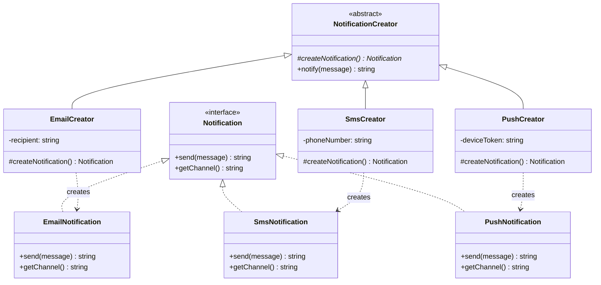

# Factory Method — 팩토리 메서드 패턴

**분류**: Creational (생성 패턴)

---

## 의도 (Intent)

객체를 생성하는 인터페이스를 정의하되, **어떤 클래스의 인스턴스를 만들지는 서브클래스가 결정**하게 한다. 객체 생성을 서브클래스에 위임해 생성 코드와 사용 코드를 분리한다.

### 어떤 문제를 해결하는가?

- 코드가 "어떤 객체를 만들어야 할지" 미리 알 수 없거나, 나중에 바뀔 가능성이 있을 때 사용한다.
- 예: 알림 시스템에서 이메일/SMS/푸시 중 어떤 채널로 보낼지 런타임에 결정해야 한다. `if-else`로 분기하면 새 채널 추가 시 기존 코드를 수정해야 한다.
- Factory Method는 새 채널을 추가할 때 새 Creator 클래스만 만들면 되어 기존 코드를 건드리지 않는다(OCP).

---

## 핵심 개념

### Creator와 Product의 분리

Creator(생성자 클래스)는 Product(생성될 객체)를 직접 `new`로 만들지 않는다. 대신 `factoryMethod()`를 호출해 Product를 얻는다. 이 메서드를 서브클래스(ConcreteCreator)가 오버라이드해 어떤 Product를 만들지 결정한다.

```
Creator.notify()
  └─ createNotification()  ← 팩토리 메서드 (추상)
        ↑ 서브클래스가 구현
EmailCreator.createNotification() → new EmailNotification()
SmsCreator.createNotification()   → new SmsNotification()
```

### 다형성으로 전략 교체

`NotificationCreator` 타입 변수에 `EmailCreator`나 `SmsCreator`를 할당할 수 있다. Creator를 교체하면 생성되는 Product도 자동으로 바뀐다.

---

## 구조 다이어그램



---

## 실무 사용 사례

| 사례 | 설명 |
|------|------|
| **알림 채널 선택** | 이메일, SMS, 슬랙, 푸시 등 채널을 추가해도 기존 코드 무변경 |
| **결제 게이트웨이** | 카드, 계좌이체, 가상화폐 등 결제 방식마다 다른 처리 객체 생성 |
| **파일 파서** | CSV, JSON, XML 등 파일 형식에 따라 다른 파서 객체 생성 |
| **UI 컴포넌트** | 플랫폼(iOS, Android, Web)에 따라 다른 컴포넌트 객체 생성 |
| **DB 드라이버** | PostgreSQL, MySQL, SQLite 드라이버를 팩토리로 교체 |

---

## 장단점

### 장점

- **OCP (개방-폐쇄 원칙)**: 새 Product 유형을 추가할 때 새 Creator 클래스만 만들면 된다. 기존 코드 수정 불필요.
- **SRP (단일 책임 원칙)**: 객체 생성 코드와 사용 코드가 분리된다.
- **유연한 확장**: Creator와 Product를 독립적으로 발전시킬 수 있다.

### 단점

- **클래스 수 증가**: Product 유형마다 ConcreteCreator 클래스가 필요해 파일이 많아진다.
- **간단한 경우 과설계**: 생성 로직이 단순하면 오히려 복잡도만 올라간다.

---

## 관련 패턴

- **Abstract Factory**: Factory Method를 여러 개 묶어 "관련 객체 군"을 생성하는 더 큰 패턴.
- **Template Method**: Factory Method와 구조가 같다. 차이는 Factory Method가 "생성"에 특화되어 있다는 것.
- **Prototype**: 새 객체를 생성하는 대신 기존 객체를 복제해 팩토리 메서드 역할을 할 수 있다.

## Vue 구현

### Vue에서 이 패턴이 어떻게 표현되는가

Vue에서 Factory Method는 **`<component :is>` 동적 컴포넌트**와 **팩토리 composable**로 구현한다.

```ts
// 팩토리 composable — Creator 역할
function useNotificationFactory(channel: Channel, message: string, target: string) {
  const componentMap = { email: EmailCard, sms: SmsCard, push: PushCard }
  return {
    component: componentMap[channel], // 어떤 Product(컴포넌트)를 만들지 결정
    props: propsMap[channel],
  }
}
```

```html
<!-- 클라이언트: 팩토리가 반환한 컴포넌트를 동적으로 렌더링 -->
<component :is="factory.component" v-bind="factory.props" />
```

### TS 구현과의 차이점

| TypeScript | Vue |
|---|---|
| 추상 클래스 + 상속 | composable 함수 |
| `createNotification()` 추상 메서드 | `componentMap[channel]` 매핑 |
| 구체 Creator 클래스들 | 팩토리 composable 내부 맵 |
| `new Product()` 생성 | `<component :is>` 동적 렌더링 |

### 사용된 Vue 개념

- **`<component :is>`**: 팩토리가 반환한 컴포넌트를 런타임에 동적으로 렌더링
- **`defineComponent` + `h()`**: 인라인 컴포넌트 정의로 별도 파일 없이 ConcreteProduct 표현
- **팩토리 composable**: Creator 추상 클래스를 함수로 대체

## React 구현

### React에서 이 패턴이 어떻게 표현되는가

컴포넌트 팩토리 함수가 `channelType` props에 따라 동적으로 컴포넌트를 생성한다.

```
createNotificationComponent(channel, props)  ← 팩토리 메서드
  ├─ 'email'  → <EmailCard />     (ConcreteProduct)
  ├─ 'sms'   → <SmsCard />       (ConcreteProduct)
  └─ 'push'  → <PushCard />      (ConcreteProduct)

NotificationSender                           ← Creator
  └─ createNotificationComponent() 호출 (어떤 컴포넌트인지 모름)
```

- `createNotificationComponent()`가 팩토리 메서드 — 어떤 컴포넌트를 만들지 결정한다.
- `NotificationSender`는 Creator — 팩토리 메서드가 반환하는 컴포넌트의 구체 타입을 알 필요 없다.
- 새 채널 추가 시 팩토리 함수에 `case`만 추가하면 된다. `NotificationSender` 코드는 변경되지 않는다.

### TS 구현과의 차이점

| TS 구현 | React 구현 |
|---|---|
| `abstract createNotification()` 메서드 | `createNotificationComponent()` 팩토리 함수 |
| `EmailCreator extends NotificationCreator` 상속 | `EmailCard` 컴포넌트 + switch 분기 |
| `notification.send(message)` 호출 | 컴포넌트 렌더링으로 대체 |

### 사용된 React 개념

- 함수형 팩토리: 컴포넌트를 값으로 반환하는 함수
- JSX 조건부 렌더링: `switch`로 ConcreteProduct 선택
- `React.ReactElement` 타입: Product 인터페이스 역할

---

## Svelte 구현

### Svelte에서 이 패턴이 어떻게 표현되는가?

Svelte 5에서는 **`createNotification(type)` 팩토리 함수**가 Factory Method 역할을 하고, **`$derived`** 가 선택된 타입이 바뀔 때마다 자동으로 새 Product를 생성한다. `<svelte:component>` 를 이용하면 UI 컴포넌트도 Factory 방식으로 동적 선택할 수 있다.

```svelte
<script lang="ts">
  let selectedType = $state<'email' | 'sms' | 'push'>('email')

  // Factory Method: 타입에 따라 다른 Product 반환
  function createNotification(type) { /* switch(type) ... */ }

  // $derived: 전략이 바뀌면 자동으로 새 Product 생성
  let notification = $derived(createNotification(selectedType))
</script>
```

### TS 구현과의 차이점

| TypeScript | Svelte 5 |
|-----------|---------|
| 추상 클래스 `NotificationCreator` + 서브클래스 | 팩토리 함수 + 객체 리터럴 |
| `EmailCreator extends NotificationCreator` | switch-case로 Product 선택 |
| `creator.notify()` 수동 호출 | `$derived`로 타입 변경 시 자동 재생성 |
| 컴파일 타임 다형성 | 런타임 함수 선택 |

### 사용된 Svelte 5 개념

- **`$state`**: 선택된 Creator 타입을 반응형으로 관리
- **`$derived`**: Factory Method 결과를 자동 계산
- **`<svelte:component this={comp} />`**: 동적 컴포넌트 선택 (UI 레벨 Factory)
