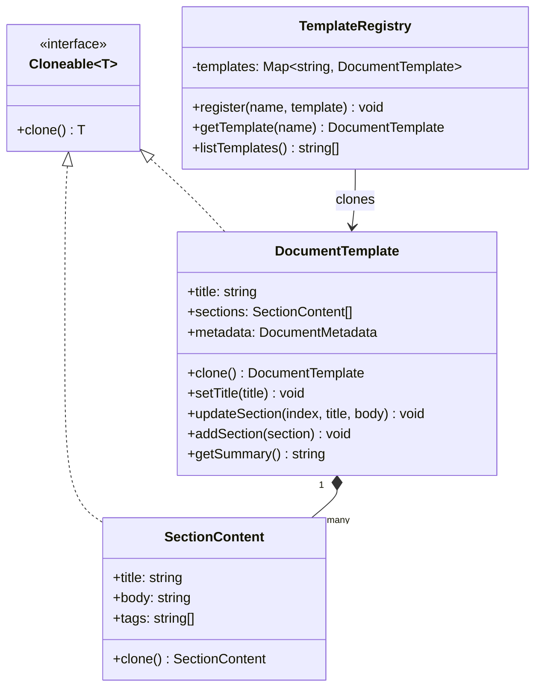

# Prototype — 프로토타입 패턴

**분류**: Creational (생성 패턴)

---

## 의도 (Intent)

**기존 객체를 복사(clone)해 새 객체를 만든다.** 클래스에 직접 의존하지 않고 객체를 복제할 수 있으며, 생성 비용이 크거나 초기 설정이 복잡한 객체를 효율적으로 재사용한다.

### 어떤 문제를 해결하는가?

- 복잡한 초기화가 필요한 객체를 매번 처음부터 만들면 비용이 크다.
- 외부에서 객체의 구체적인 클래스를 모르는 상태에서 동일한 객체를 만들어야 할 때, `new ConcreteClass()`를 직접 호출할 수 없다.
- Prototype은 "원형 객체를 등록해두고 필요할 때 복제"하는 방식으로 이 문제를 해결한다.

```
처음부터 생성: new DocumentTemplate(title, [section1, section2, section3], metadata)
Prototype 사용: registry.getTemplate('meeting') // 등록된 원형을 복제해 반환
```

---

## 핵심 개념

### 얕은 복사 vs 깊은 복사

**얕은 복사(shallow copy)**: 객체의 최상위 필드만 복사한다. 중첩 객체(배열, 다른 객체)는 참조를 공유한다.
```
original.tags → ["tag1"]
clone.tags    → 같은 배열 참조  ← 위험! clone.tags.push()가 original도 바꾼다
```

**깊은 복사(deep copy)**: 중첩된 모든 객체를 새로 만든다.
```
original.tags → ["tag1"]
clone.tags    → ["tag1"] (새 배열) ← 안전! 서로 독립적
```

이 구현에서는 `SectionContent.clone()`이 `tags.slice()`로 배열을 복사하고, `DocumentTemplate.clone()`이 `sections.map(s => s.clone())`으로 각 섹션을 개별 복제한다.

### 프로토타입 레지스트리

자주 쓰는 원형 객체를 이름으로 등록해 두고, 필요할 때마다 복제해 제공한다. 클라이언트는 구체 클래스를 몰라도 이름만으로 객체를 얻을 수 있다.

---

## 구조 다이어그램



---

## 실무 사용 사례

| 사례 | 설명 |
|------|------|
| **문서 템플릿** | 회의록, 보고서 등 자주 쓰는 문서 구조를 복제해 재사용 |
| **게임 오브젝트** | 몬스터, 아이템 등 같은 유형의 객체를 원형에서 대량 복제 |
| **설정 복사** | 기존 설정 프로파일을 복제해 수정 후 새 프로파일로 저장 |
| **상태 스냅샷** | 현재 객체 상태를 복제해 저장해두고 나중에 되돌리기 (Memento와 결합) |
| **테스트 픽스처** | 기본 테스트 데이터 객체를 복제해 각 테스트에서 독립적으로 수정 |

---

## 장단점

### 장점

- **생성 비용 절감**: 복잡한 초기화 과정 없이 기존 객체를 복사해 빠르게 만든다.
- **구체 클래스 독립**: 클라이언트가 구체 클래스를 몰라도 `clone()`으로 동일한 객체를 얻을 수 있다.
- **런타임 유연성**: 어떤 객체를 복제할지 런타임에 결정할 수 있다.
- **복잡한 초기화 캡슐화**: 복제 로직이 클래스 내부에 있어 클라이언트가 신경 쓰지 않아도 된다.

### 단점

- **깊은 복사의 복잡성**: 중첩 객체가 많을수록 `clone()` 구현이 복잡해진다. 순환 참조가 있으면 특히 어렵다.
- **private 필드 접근**: 일부 언어에서 같은 클래스의 private 필드에만 접근 가능해 서브클래스 복제가 까다롭다.
- **클론 메서드 유지 부담**: 필드를 추가할 때마다 `clone()` 내부도 함께 업데이트해야 한다.

---

## 관련 패턴

- **Abstract Factory**: 프로토타입 객체를 복제하는 방식으로 Abstract Factory를 구현할 수 있다.
- **Composite / Decorator**: 복잡한 트리 구조를 복제할 때 Prototype이 유용하다.
- **Memento**: 객체 상태를 저장하고 복원하는 Memento가 내부적으로 Prototype(clone)을 활용한다.
- **Command**: 커맨드 히스토리를 저장할 때 커맨드 객체를 복제해 저장하기도 한다.
