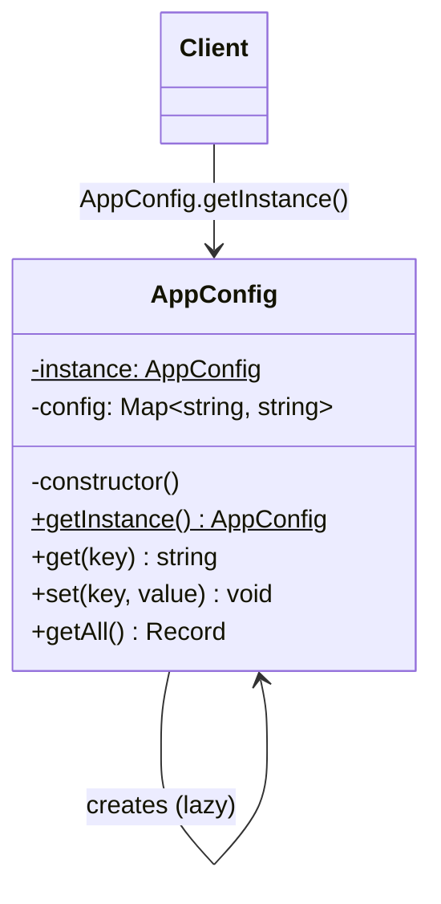

# Singleton — 단일체 패턴

**분류**: Creational (생성 패턴)

---

## 의도 (Intent)

클래스의 인스턴스가 **오직 하나만** 존재하도록 보장하고, 어디서든 그 인스턴스에 접근할 수 있는 **전역 진입점**을 제공한다.

### 어떤 문제를 해결하는가?

- 애플리케이션 설정(Config), 로거(Logger), DB 커넥션 풀처럼 **전역에서 공유되어야 하는 자원**이 여러 개 만들어지면 일관성이 깨진다.
- 예: `new AppConfig()`를 두 곳에서 각각 호출하면 서로 다른 설정 객체가 생겨 한쪽에서 설정을 바꿔도 다른 쪽에 반영되지 않는다.
- Singleton은 이런 상황에서 "전역 변수처럼 쓰되, 객체지향 방식으로 캡슐화된 형태"를 제공한다.

---

## 핵심 개념

### Lazy Initialization (지연 초기화)

인스턴스를 **처음 요청받는 순간**에 생성한다. 앱 시작 시 모든 것을 미리 만들지 않고, 실제로 필요할 때 만들어 메모리를 아낀다.

```
최초 호출: getInstance() → instance가 null → new AppConfig() 생성 → 반환
이후 호출: getInstance() → instance가 이미 있음 → 기존 인스턴스 반환
```

### Private Constructor (비공개 생성자)

`private constructor()`로 선언해 외부에서 `new AppConfig()`를 호출하지 못하게 막는다. 인스턴스를 만드는 유일한 방법은 `getInstance()`뿐이다.

### Static Instance (정적 인스턴스)

인스턴스를 클래스 내부의 `static` 필드에 보관한다. `static`이므로 클래스 자체에 귀속되어 모든 호출에서 동일한 필드를 참조한다.

---

## 구조 다이어그램



---

## 실무 사용 사례

| 사례 | 이유 |
|------|------|
| **앱 설정 관리** | 환경변수, API URL 등 전역 설정은 하나여야 일관성이 유지된다 |
| **로거 (Logger)** | 모든 모듈이 같은 로거 인스턴스에 로그를 써야 순서가 보장된다 |
| **DB 커넥션 풀** | 커넥션 풀이 여러 개면 리소스 낭비 및 풀 한도 초과가 발생한다 |
| **이벤트 버스** | 전역 이벤트 시스템은 하나의 채널로 통합되어야 구독/발행이 일치한다 |
| **캐시 매니저** | 캐시가 여러 개면 같은 키에 대해 다른 값을 보게 된다 |

---

## 장단점

### 장점

- **인스턴스 보장**: 전역에서 동일한 객체를 공유하므로 상태 불일치가 없다.
- **지연 초기화**: 실제 사용 전까지 메모리를 소모하지 않는다.
- **전역 접근점**: 어디서든 `getInstance()`로 접근 가능해 의존성 주입 없이도 쓸 수 있다.

### 단점

- **테스트 어려움**: 전역 상태를 공유하므로 테스트 간 격리가 어렵다. (`resetInstance()` 같은 우회책 필요)
- **단일 책임 원칙 위반**: 클래스가 "자신의 유일성을 보장"하는 책임을 추가로 갖는다.
- **숨겨진 의존성**: 코드 어디서든 호출할 수 있어 의존 관계가 불투명해진다.
- **멀티스레드 주의**: JavaScript/TypeScript는 단일 스레드라 문제없지만, Java 등에서는 `synchronized`가 필요하다.

---

## 관련 패턴

- **Monostate**: Singleton의 대안. 인스턴스는 여러 개지만 상태를 `static`으로 공유한다.
- **Facade**: 복잡한 서브시스템에 단일 진입점을 제공한다는 점에서 유사하다.
- **Abstract Factory / Builder**: 이 패턴들의 구현체가 Singleton으로 만들어지는 경우가 많다.

## Vue 구현

### Vue에서 이 패턴이 어떻게 표현되는가

Vue에서 Singleton은 **ES 모듈 스코프 변수**와 **provide/inject**로 구현한다.

```ts
// composable 모듈 최상단 — 파일이 처음 import될 때 딱 한 번 생성된다.
const _config = reactive<Record<string, string>>({ logLevel: 'info', ... })

export function useAppConfig() {
  // 어디서 호출해도 동일한 _config를 참조한다 → Singleton 보장
  return { config: _config, get, set }
}
```

App 루트에서 `provide`로 주입하면 하위 컴포넌트 어디서든 `inject`로 동일 인스턴스에 접근한다.

### TS 구현과의 차이점

| TypeScript | Vue |
|---|---|
| `private static instance` 필드 | ES 모듈 스코프 변수 |
| `private constructor()` | 없음 (모듈이 격리를 보장) |
| `getInstance()` 정적 메서드 | `useAppConfig()` composable |
| 전역 접근 | `provide` / `inject` |

### 사용된 Vue 개념

- **`reactive()`**: 설정 저장소를 반응형으로 만들어 변경 시 UI 자동 갱신
- **ES 모듈 스코프**: 모듈 최상단 변수가 인스턴스 유일성을 자연스럽게 보장
- **`provide` / `inject`**: 컴포넌트 트리 어디서든 같은 인스턴스에 접근하는 전역 진입점
- **`InjectionKey`**: 타입 안전한 provide/inject를 위한 Symbol 키

## React 구현

### React에서 이 패턴이 어떻게 표현되는가

Context + `useRef`로 전역 단일 인스턴스를 구현한다.

```
AppConfigProvider (Provider)
  └─ AppConfigContext (전역 진입점 = getInstance())
       ├─ ComponentA → useAppConfig() 훅으로 접근
       └─ ComponentB → 동일한 인스턴스에 접근
```

- `AppConfigProvider`가 `useRef`로 config 객체를 단 한 번 생성한다.
- `useAppConfig()` 훅이 `getInstance()`에 해당한다 — 어떤 depth에서 호출해도 같은 인스턴스를 반환한다.
- `useRef`를 쓰는 이유: `useState`와 달리 값이 바뀌어도 리렌더링을 유발하지 않으며, 컴포넌트 재렌더 사이에서도 동일한 객체 참조를 유지한다.

### TS 구현과의 차이점

| TS 구현 | React 구현 |
|---|---|
| `private static instance` 필드 | `useRef`로 모듈 수준 인스턴스 보관 |
| `getInstance()` static 메서드 | `useAppConfig()` 커스텀 훅 |
| `new AppConfig()` 생성자 차단 | Provider가 단 하나만 마운트됨 |

### 사용된 React 개념

- `createContext` / `useContext`: 전역 진입점 (어디서든 접근 가능)
- `useRef`: 리렌더링 사이에서도 동일한 객체 참조 유지
- `Provider` 패턴: 인스턴스를 컴포넌트 트리에 주입

---

## Svelte 구현

### Svelte에서 이 패턴이 어떻게 표현되는가?

Svelte 5에서는 **모듈 스코프 `$state` 변수**가 자연스럽게 Singleton 역할을 한다. ES 모듈은 앱 전체에서 한 번만 로드되므로, 모듈 최상위에 선언된 `$state` 변수는 모든 컴포넌트가 공유하는 단일 인스턴스가 된다.

```svelte
<!-- 모듈 스코프 $state = Singleton 인스턴스 -->
<script lang="ts">
  let config = $state({ logLevel: 'info', apiUrl: 'https://api.example.com' })
  // 어떤 컴포넌트에서 import해도 항상 같은 config 객체
</script>
```

### TS 구현과의 차이점

| TypeScript | Svelte 5 |
|-----------|---------|
| `private static instance` 필드 | 모듈 스코프 변수 (모듈 자체가 Singleton 보장) |
| `getInstance()` 정적 메서드 | 변수를 직접 import해서 사용 |
| `private constructor()` | 없음 — 모듈 시스템이 단일 로드를 보장 |
| 수동 `lazy initialization` | 모듈 로드 시 자동 초기화 |

### 사용된 Svelte 5 개념

- **`$state`**: 반응형 상태 선언 — 값이 바뀌면 UI가 자동 업데이트
- **`$derived`**: config 키 목록 등 상태에서 파생된 값을 자동 계산
- **모듈 스코프**: 파일 최상위에 선언된 변수가 모든 import에서 공유됨
