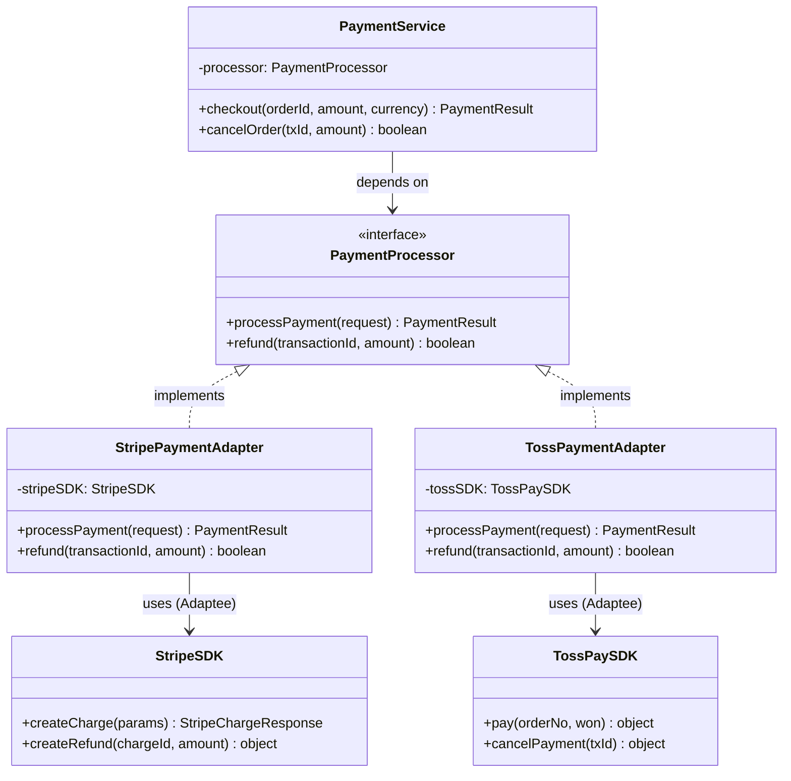

# Adapter (어댑터) 패턴

**분류:** 구조 패턴 (Structural Pattern)

---

## 의도 (Intent)

호환되지 않는 인터페이스를 가진 객체들이 협력할 수 있도록 **중간에서 변환해주는 래퍼(wrapper)**를 제공한다. 마치 110V 제품을 220V 콘센트에 꽂기 위해 변환 어댑터를 사용하는 것과 같다.

---

## 핵심 개념 설명

### 왜 어댑터가 필요한가?

현실에서 외부 라이브러리나 레거시 코드는 우리 앱의 인터페이스와 맞지 않는 경우가 많다. 예를 들어:

- 우리 앱은 `processPayment(request)` 메서드를 기대한다.
- Stripe SDK는 `createCharge(params)` 메서드를 제공한다.
- 파라미터 형식도 다르다 (원화 vs 센트).

이때 두 가지 선택지가 있다:
1. 우리 앱 코드 전체를 Stripe 형식에 맞게 수정한다 → 결제사 교체 시 또 전체 수정
2. **어댑터를 만들어 Stripe를 우리 인터페이스처럼 쓴다** → 결제사 교체해도 어댑터만 교체

### 두 종류의 어댑터

**객체 어댑터 (Object Adapter)**: 구성(Composition)을 사용한다. Adaptee 인스턴스를 내부에 보유한다.
- 장점: 런타임에 Adaptee를 교체할 수 있다. 다중 Adaptee 지원 가능.
- 대부분의 경우 이 방식을 사용한다.

**클래스 어댑터 (Class Adapter)**: 상속을 사용한다. Adaptee를 상속한다.
- 단점: TypeScript에서는 단일 상속만 가능하므로 제약이 있다.

이 구현은 **객체 어댑터** 방식을 사용한다.

---

## 구조 다이어그램



---

## 실무 사용 사례

| 사례 | Target | Adaptee |
|------|--------|---------|
| 결제 라이브러리 통합 | 내부 결제 인터페이스 | Stripe, Toss, PayPal SDK |
| 클라우드 스토리지 | 내부 파일 저장 인터페이스 | AWS S3, GCP Storage, Azure Blob |
| 지도 API | 내부 지도 인터페이스 | Google Maps, Naver Maps, Kakao Maps |
| 로그 시스템 | 내부 Logger 인터페이스 | Winston, Bunyan, Pino |
| XML → JSON 변환 | JSON 기반 시스템 | 레거시 XML 서비스 |

---

## 장단점

### 장점
- **단일 책임 원칙**: 변환 로직이 어댑터 한 곳에 집중된다.
- **개방-폐쇄 원칙**: 새 어댑터를 추가해도 기존 클라이언트 코드를 수정하지 않는다.
- **결합도 감소**: 클라이언트는 외부 라이브러리에 직접 의존하지 않는다.
- **교체 용이성**: 결제사를 Stripe → Toss로 바꿔도 어댑터만 교체하면 된다.

### 단점
- **클래스 수 증가**: 각 외부 시스템마다 어댑터 클래스가 생긴다.
- **복잡성**: 단순한 경우에는 오버엔지니어링이 될 수 있다.
- **성능**: 간접 호출 레이어가 추가되어 약간의 오버헤드가 있다.

---

## 관련 패턴

- **Facade**: 어댑터는 인터페이스를 *변환*하고, 퍼사드는 인터페이스를 *단순화*한다.
- **Decorator**: 데코레이터는 인터페이스를 *유지*하면서 기능을 추가하고, 어댑터는 인터페이스를 *변환*한다.
- **Proxy**: 프록시는 같은 인터페이스를 유지하지만, 어댑터는 다른 인터페이스로 변환한다.
- **Bridge**: 브릿지는 설계 시점에 추상화와 구현을 분리하고, 어댑터는 기존 코드를 맞추기 위해 사용한다.

## Vue 구현

### Vue에서 이 패턴이 어떻게 표현되는가

Vue에서 Adapter는 **외부 라이브러리를 래핑하는 composable**로 구현한다.

```ts
// Adapter composable — 외부 SDK를 우리 앱 인터페이스로 래핑
function useStripeAdapter() {
  const sdk = new StripeSDK('sk_test_...')

  function processPayment(request: PaymentRequest): PaymentResult {
    // 원화 → 센트, orderId → metadata 변환
    const stripeResponse = sdk.createCharge({ amount_in_cents: ..., ... })
    return { success: stripeResponse.status === 'succeeded', ... }
  }

  return { processPayment, refund }
}
```

컴포넌트는 `useStripeAdapter()`와 `useTossAdapter()` 중 어느 것을 사용해도 동일한 인터페이스로 동작한다.

### TS 구현과의 차이점

| TypeScript | Vue |
|---|---|
| `StripePaymentAdapter` 클래스 | `useStripeAdapter()` composable |
| `implements PaymentProcessor` | 동일한 반환 타입 형태로 타입 맞춤 |
| 생성자 주입 | composable 내부에서 SDK 직접 생성 |

### 사용된 Vue 개념

- **래핑 composable**: 외부 SDK를 composable로 감싸는 것이 Vue의 Adapter 관용 표현
- **런타임 교체**: `ref`에 어댑터를 저장해 결제사를 런타임에 교체 가능
- **`reactive()`**: 결과 상태를 반응형으로 관리해 UI 자동 갱신

## React 구현

### React에서 이 패턴이 어떻게 표현되는가

커스텀 훅이 어댑터 역할을 한다. 외부 SDK의 인터페이스를 우리 앱의 표준 훅 인터페이스로 변환한다.

```
useStripeAdapter()     ← Adapter 1: Stripe SDK → PaymentHook
useTosstAdapter()      ← Adapter 2: Toss SDK  → PaymentHook

CheckoutPanel          ← Client
  └─ payment.processPayment()  (PaymentHook 인터페이스만 사용)
```

- `useStripeAdapter()`, `useTossAdapter()`가 각 Adapter — 서로 다른 SDK 인터페이스를 같은 `PaymentHook` 타입으로 감싼다.
- `CheckoutPanel`은 `PaymentHook` 타입만 알면 된다. 어떤 결제사를 쓰는지 전혀 알 필요 없다.
- 결제사를 교체해도 `CheckoutPanel` 코드는 한 줄도 바뀌지 않는다.

### TS 구현과의 차이점

| TS 구현 | React 구현 |
|---|---|
| `class StripePaymentAdapter implements PaymentProcessor` | `function useStripeAdapter(): PaymentHook` |
| Adaptee를 클래스 필드로 보유 | 어댑터 함수 내 클로저로 SDK 캡처 |
| 클라이언트가 어댑터를 `new`로 생성 | 클라이언트가 어댑터 훅을 호출 |

### 사용된 React 개념

- 커스텀 훅: 외부 라이브러리 래핑 및 인터페이스 변환
- `useCallback`: 어댑터 메서드 메모이제이션
- 의존성 주입: `payment` prop으로 어댑터를 컴포넌트에 주입

---

## Svelte 구현

### Svelte에서 이 패턴이 어떻게 표현되는가?

Svelte 5에서는 어댑터를 **동일한 인터페이스를 가진 객체 리터럴**로 구현하고, `$state`로 선택된 어댑터를 `$derived`로 참조한다. 클라이언트(UI)는 항상 같은 `processPayment()` 함수를 호출하지만, 선택된 어댑터에 따라 내부적으로 다른 SDK가 동작한다.

```svelte
<script lang="ts">
  const stripeAdapter = {
    processPayment(orderId, amount, currency) {
      // Stripe SDK 형식으로 변환 후 호출
    }
  }
  const tossAdapter = { processPayment(...) { /* Toss SDK */ } }

  let selectedName = $state('Stripe')
  let adapter = $derived(selectedName === 'Stripe' ? stripeAdapter : tossAdapter)
  // 클라이언트는 항상 adapter.processPayment() — 어댑터가 바뀌어도 코드 불변
</script>
```

### TS 구현과의 차이점

| TypeScript | Svelte 5 |
|-----------|---------|
| `StripePaymentAdapter implements PaymentProcessor` 클래스 | 동일 인터페이스 형태의 객체 리터럴 |
| 의존성 주입(생성자) | `$derived`로 선택 |
| 컴파일 타임 타입 검사 | 런타임 덕 타이핑 |

### 사용된 Svelte 5 개념

- **`$state`**: 선택된 어댑터 이름을 반응형으로 관리
- **`$derived`**: 어댑터 선택에 따라 자동으로 현재 어댑터 참조 업데이트
