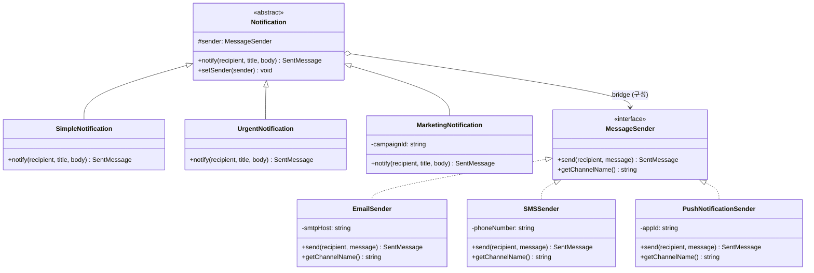

# Bridge (브릿지) 패턴

**분류:** 구조 패턴 (Structural Pattern)

---

## 의도 (Intent)

**추상화(Abstraction)와 구현(Implementation)을 분리**하여 각각 독립적으로 변형할 수 있게 한다. 상속의 조합 폭발 문제를 구성(Composition)으로 해결한다.

---

## 핵심 개념 설명

### 조합 폭발 문제

알림 시스템을 상속으로 설계하면:

```
알림 종류: 일반, 긴급, 마케팅 (3가지)
전송 방식: 이메일, SMS, 푸시 알림 (3가지)
→ 필요한 클래스: 3 × 3 = 9개
```

여기서 새 알림 종류 1개, 새 전송 방식 1개를 추가하면:
```
4 × 4 = 16개 (7개 추가)
```

브릿지 패턴을 쓰면:
```
4 + 4 = 8개 (2개만 추가)
```

### 핵심 아이디어: "무엇을"과 "어떻게"의 분리

- **추상화 계층 (Abstraction)**: "무엇을 전달할 것인가" — 알림의 종류, 메시지 형식
- **구현 계층 (Implementor)**: "어떻게 전달할 것인가" — 이메일, SMS, 푸시

이 두 계층은 **브릿지(참조)**로만 연결된다. 각자 독립적으로 변경, 확장, 테스트할 수 있다.

---

## 구조 다이어그램



---

## 실무 사용 사례

| 사례 | Abstraction | Implementor |
|------|------------|-------------|
| 알림 시스템 | 알림 종류 (일반, 긴급) | 전송 채널 (이메일, SMS) |
| 렌더러 | 도형 (원, 사각형) | 렌더링 API (OpenGL, DirectX) |
| 데이터 내보내기 | 보고서 종류 | 출력 형식 (PDF, Excel, HTML) |
| 결제 처리 | 결제 종류 (일반, 구독) | 결제사 (Stripe, Toss) |
| 로깅 | 로그 레벨 분류기 | 로그 저장소 (파일, DB, 콘솔) |

---

## 장단점

### 장점
- **조합 폭발 방지**: N×M → N+M 클래스로 줄어든다.
- **독립적 확장**: 추상화와 구현을 독립적으로 확장할 수 있다.
- **런타임 교체**: `setSender()`로 전송 방식을 실행 중에 바꿀 수 있다.
- **단일 책임 원칙**: 추상화와 구현이 각자의 책임만 가진다.
- **개방-폐쇄 원칙**: 기존 코드를 수정하지 않고 새 추상화/구현 추가 가능.

### 단점
- **초기 설계 복잡도**: 어떤 차원을 분리할지 미리 파악해야 한다.
- **간접 참조**: 구현에 접근하기 위해 한 단계 더 거친다.
- **과설계 위험**: 조합이 적을 때는 단순한 상속이 더 명확할 수 있다.

---

## 관련 패턴

- **Adapter**: 어댑터는 기존 코드를 *맞추기* 위한 것이고, 브릿지는 *설계 시점에* 분리를 계획한다.
- **Strategy**: 전략 패턴과 유사하지만, 전략은 알고리즘 교체에 초점을 두고, 브릿지는 추상화-구현 분리에 초점을 둔다.
- **Abstract Factory**: 브릿지와 함께 써서 구현체를 생성하는 데 사용할 수 있다.
- **Composite**: 브릿지와 결합하여 트리 구조에서 추상화-구현을 분리할 수 있다.
