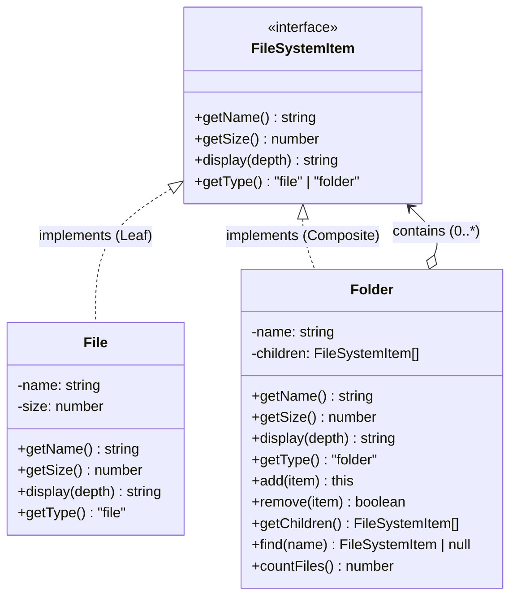

# Composite (컴포지트) 패턴

**분류:** 구조 패턴 (Structural Pattern)

---

## 의도 (Intent)

객체들을 **트리 구조로 구성**하여 개별 객체(Leaf)와 복합 객체(Composite)를 **동일한 인터페이스로 다룰 수 있게** 한다. 클라이언트는 단일 객체인지 복합 객체인지 구별하지 않아도 된다.

---

## 핵심 개념 설명

### 문제 상황

파일 시스템을 생각해보자:
- `파일.크기()` → 해당 파일의 크기를 반환
- `폴더.크기()` → 폴더 안의 모든 파일과 폴더 크기의 합계를 반환

클라이언트 입장에서 파일이든 폴더든 `.크기()`를 호출하면 올바른 결과를 얻어야 한다. 폴더인지 파일인지 매번 확인하는 코드를 쓰고 싶지 않다.

### 해결책: 동일한 인터페이스

```typescript
// 이런 코드를 피하고 싶다
if (item instanceof File) {
  return item.getSize();
} else if (item instanceof Folder) {
  return item.getAllChildrenSize(); // 재귀 탐색 직접 구현...
}

// 컴포지트 패턴: 이렇게 쓸 수 있다
return item.getSize(); // File이든 Folder든 같은 메서드
```

### 재귀적 위임 (Recursive Delegation)

Composite(폴더)의 `getSize()`는 자식들의 `getSize()`를 호출하고 합산한다. 자식이 Folder라면 그 Folder도 같은 방식으로 재귀 호출한다. 클라이언트는 깊이가 얼마나 깊든 신경 쓸 필요가 없다.

---

## 구조 다이어그램



---

## 실무 사용 사례

| 사례 | Leaf | Composite |
|------|------|-----------|
| 파일 시스템 | 파일 | 폴더 |
| UI 컴포넌트 | 버튼, 텍스트 | 패널, 레이아웃 |
| 조직 구조 | 직원 | 팀, 부서 |
| 메뉴 시스템 | 메뉴 항목 | 서브메뉴, 메뉴 그룹 |
| HTML DOM | 텍스트 노드 | 엘리먼트 노드 |
| 쇼핑 카트 | 상품 | 상품 묶음, 번들 |

---

## 장단점

### 장점
- **단순한 클라이언트 코드**: 트리의 깊이에 상관없이 동일한 코드로 처리한다.
- **재귀 구조 자연 표현**: 트리 구조를 표현하기에 가장 자연스러운 패턴이다.
- **개방-폐쇄 원칙**: 새 Leaf 타입을 추가해도 기존 코드를 수정하지 않는다.
- **유연한 구조**: 런타임에 트리 구조를 동적으로 변경할 수 있다.

### 단점
- **타입 안전성 약화**: 공통 인터페이스로 인해 Leaf에 없는 메서드(`add`, `remove`)를 억지로 추가해야 할 수 있다.
- **과도한 일반화**: 모든 컴포넌트를 동일하게 다루면 특정 타입에만 의미있는 제약을 걸기 어렵다.
- **설계 어려움**: Component 인터페이스를 얼마나 일반화할지 결정하기 어렵다.

---

## 관련 패턴

- **Iterator**: 컴포지트 트리를 순회할 때 이터레이터 패턴을 함께 쓸 수 있다.
- **Visitor**: 컴포지트 구조 전체를 순회하며 작업할 때 비지터 패턴을 활용한다.
- **Decorator**: 데코레이터도 컴포지트처럼 재귀 구조를 사용하지만, 하나의 자식만 가진다.
- **Flyweight**: 컴포지트 트리의 Leaf 노드가 많을 때 플라이웨이트로 메모리를 절약할 수 있다.
- **Chain of Responsibility**: 컴포지트 트리 구조와 결합하여 이벤트를 전파할 수 있다.

## Vue 구현

### Vue에서 이 패턴이 어떻게 표현되는가

Vue에서 Composite는 **재귀 컴포넌트**로 구현한다. 하나의 컴포넌트가 Leaf와 Composite 역할을 모두 처리한다.

```html
<!-- FileTreeNode.vue — 자기 자신을 재귀 렌더링 -->
<template>
  <div>
    <!-- 노드 자체 표시 (Leaf든 Composite든 동일) -->
    <div @click="toggle">{{ node.name }}</div>

    <!-- Composite일 때만 자식을 재귀 렌더링 -->
    <template v-if="node.type === 'folder' && isOpen">
      <FileTreeNode
        v-for="child in node.children"
        :node="child"
        :depth="depth + 1"
      />
    </template>
  </div>
</template>
```

### TS 구현과의 차이점

| TypeScript | Vue |
|---|---|
| `File` 클래스 (Leaf) | `node.type === 'file'` 분기 |
| `Folder` 클래스 (Composite) | `node.type === 'folder'` 분기 |
| `display(depth)` 재귀 메서드 | 재귀 컴포넌트 렌더링 |
| `getSize()` 재귀 계산 | `computed` + 재귀 함수 |

### 사용된 Vue 개념

- **재귀 컴포넌트**: 컴포넌트가 자기 자신을 `<FileTreeNode>`로 참조해 트리 구조를 자연스럽게 표현
- **`computed()`**: 폴더의 전체 크기를 재귀적으로 계산하고 자동 캐싱
- **`v-if` + `v-for`**: 폴더 열림/닫힘 상태와 자식 목록 렌더링 제어

## React 구현

### React에서 이 패턴이 어떻게 표현되는가

재귀 컴포넌트가 Composite 패턴을 자연스럽게 표현한다.

```
FileTreeNode (통합 진입점)
  ├─ type === 'file'   → <FileItem />    (Leaf)
  └─ type === 'folder' → <FolderItem />  (Composite)
                              └─ children.map(child => <FileTreeNode />)  ← 재귀!
```

- `FileTreeNode`가 클라이언트용 통합 컴포넌트 — `FileNode` 타입만 받고 내부적으로 `FileItem`/`FolderItem`을 결정한다.
- `FolderItem`이 자식을 렌더할 때 `FileTreeNode`를 재귀 호출한다 — TS의 `Folder.display()`가 자식 `display()`를 재귀 호출한 것과 동일.
- 트리 깊이와 관계없이 자동으로 처리된다.

### TS 구현과의 차이점

| TS 구현 | React 구현 |
|---|---|
| `File`, `Folder` 클래스 | `FileItem`, `FolderItem` 컴포넌트 |
| `getSize()` 재귀 메서드 | `getTotalSize()` 재귀 함수 |
| `display(depth)` 재귀 | `FileTreeNode` 재귀 렌더링 |

### 사용된 React 개념

- 재귀 컴포넌트: 컴포넌트가 자기 자신을 children 렌더에서 호출
- `useState`: 폴더 열림/닫힘 상태 관리
- 트리 데이터 구조: 중첩된 `FileNode` 타입으로 표현

---

## Svelte 구현

### Svelte에서 이 패턴이 어떻게 표현되는가?

Svelte 5에서는 유니온 타입(`FileNode | FolderNode`)으로 Leaf/Composite를 표현하고, **`{#snippet renderNode}`** 또는 별도 컴포넌트에서 `<svelte:self>`로 재귀 렌더링을 구현한다. 재귀 연산(`getSize()`, `countFiles()`)은 재귀 함수로 구현하며, `$derived`로 변경 시 자동 재계산된다.

```svelte
<script lang="ts">
  type FileSystemNode = FileNode | FolderNode

  function getSize(node: FileSystemNode): number {
    if (node.type === 'file') return node.size
    return node.children.reduce((sum, child) => sum + getSize(child), 0)
  }

  let totalSize = $derived(formatSize(getSize(tree)))
</script>

{#snippet renderNode(node, depth)}
  {#if node.type === 'folder'}
    {#each node.children as child}
      {@render renderNode(child, depth + 1)}
    {/each}
  {/if}
{/snippet}
```

### TS 구현과의 차이점

| TypeScript | Svelte 5 |
|-----------|---------|
| `File`, `Folder` 클래스 계층 | 유니온 타입 + 객체 리터럴 |
| 재귀 메서드 호출 | `{#snippet}` 재귀 렌더링 |
| `instanceof Folder` 타입 가드 | `node.type === 'folder'` 판별 |

### 사용된 Svelte 5 개념

- **`{#snippet}`**: 재귀적으로 자기 자신을 렌더링하는 스니펫
- **`$state`**: 트리 구조를 반응형으로 관리 (노드 추가/삭제 즉시 반영)
- **`$derived`**: 전체 크기·파일 수 등 재귀 연산 결과 자동 계산
