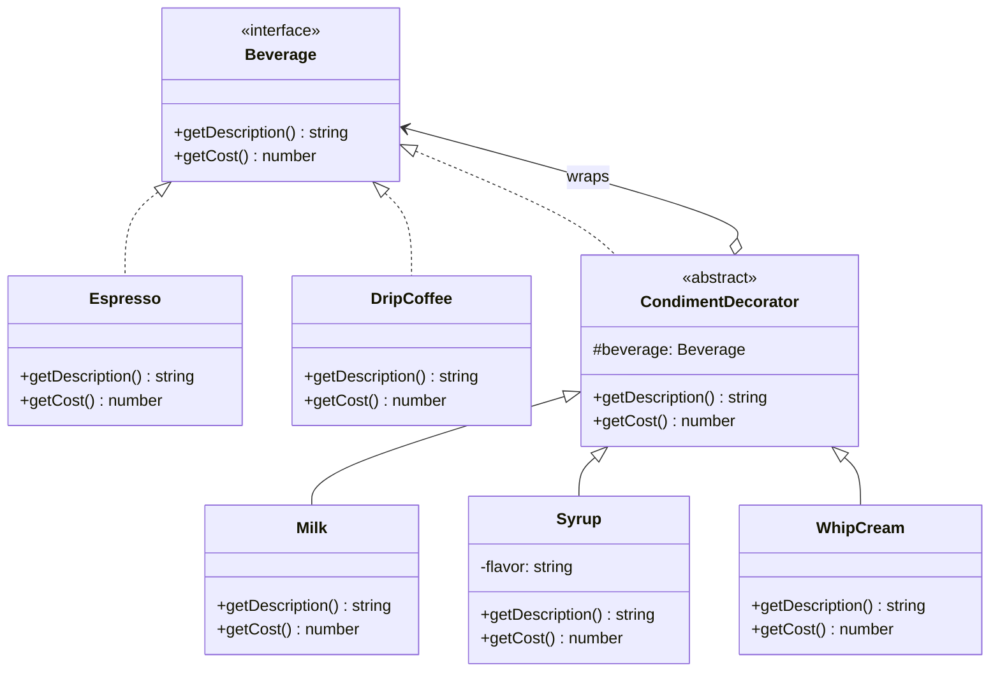

# Decorator (데코레이터) 패턴

**분류:** 구조 패턴 (Structural Pattern)

---

## 의도 (Intent)

객체에 **동적으로 새로운 책임을 추가**한다. 기능 확장에 서브클래싱 대신 **래핑(wrapping)**을 사용하여 클래스 폭발 문제를 피한다.

---

## 핵심 개념 설명

### 상속의 한계

커피 주문 시스템에서 토핑 조합을 상속으로 구현하면:

```
에스프레소
에스프레소+우유
에스프레소+시럽
에스프레소+휘핑크림
에스프레소+우유+시럽
에스프레소+우유+휘핑크림
에스프레소+시럽+휘핑크림
에스프레소+우유+시럽+휘핑크림
드립커피+...
...
```

토핑 3개면 이미 수십 개의 클래스가 필요하다.

### 데코레이터의 해법: 감싸기(Wrapping)

```
기본 커피 객체를 다른 객체로 감싼다.
에스프레소 → Milk(에스프레소) → Syrup(Milk(에스프레소))
```

각 데코레이터는 **자신의 래핑 대상(inner)에 자신의 기여분을 추가**한다. 감싸는 횟수나 순서는 제한이 없다.

### 자기 참조 구조가 핵심

데코레이터가 작동하는 이유:
1. `CondimentDecorator`가 `Beverage`를 **구현(implements)**한다 → 데코레이터 자신도 `Beverage` 타입
2. `CondimentDecorator`가 `Beverage`를 **보유(has-a)**한다 → 내부 음료에 위임 가능

이 두 조건이 동시에 성립하기 때문에 `Milk(Syrup(Espresso()))` 같은 무한 중첩이 가능하다.

---

## 구조 다이어그램



---

## 실무 사용 사례

| 사례 | Component | 데코레이터 예시 |
|------|-----------|----------------|
| HTTP 미들웨어 | 기본 핸들러 | 인증, 로깅, 압축, 캐싱 |
| 스트림 (Java I/O) | InputStream | BufferedInputStream, GZIPInputStream |
| UI 컴포넌트 | 기본 위젯 | 스크롤바, 테두리, 툴팁 |
| 로깅 | 기본 Logger | 타임스탬프, 색상, 필터 추가 |
| 결제 처리 | 기본 결제 | 할인, 세금, 적립금 처리 |

---

## 장단점

### 장점
- **서브클래싱 없이 확장**: 런타임에 동적으로 기능을 추가/제거할 수 있다.
- **단일 책임 원칙**: 각 데코레이터가 하나의 기능만 담당한다.
- **유연한 조합**: 데코레이터를 자유롭게 조합하여 다양한 동작을 만든다.
- **개방-폐쇄 원칙**: 기존 클래스를 수정하지 않고 새 데코레이터만 추가한다.

### 단점
- **많은 작은 객체**: 많은 데코레이터를 사용하면 객체 수가 늘어난다.
- **디버깅 어려움**: 중첩된 래퍼를 추적하기 어렵다.
- **순서 의존성**: 일부 경우 데코레이터 적용 순서가 결과에 영향을 줄 수 있다.
- **특정 타입 확인 어려움**: 래핑된 객체의 실제 타입을 확인하기 번거롭다.

---

## 관련 패턴

- **Composite**: 데코레이터는 자식이 하나인 컴포지트로 볼 수 있다. 둘 다 재귀 구조를 사용한다.
- **Strategy**: 데코레이터는 객체의 겉(껍데기)을 바꾸고, 전략은 객체의 속(알고리즘)을 바꾼다.
- **Adapter**: 어댑터는 다른 인터페이스를 제공하고, 데코레이터는 같은 인터페이스를 유지한다.
- **Proxy**: 프록시는 같은 인터페이스를 유지하지만 주로 접근 제어 목적이다. 데코레이터는 기능 추가 목적이다.
- **Chain of Responsibility**: 데코레이터와 유사한 재귀 구조이지만, 책임 연쇄는 요청을 처리하는 핸들러를 찾는다.

## Vue 구현

### Vue에서 이 패턴이 어떻게 표현되는가

Vue에서 Decorator는 **`computed` 체이닝**으로 구현한다. 선택된 토핑을 순서대로 reduce하며 description과 cost를 누적한다.

```ts
// TypeScript: new Milk(new Syrup(new Espresso()))
// Vue: computed로 누적 계산
const decoratedDescription = computed(() => {
  let desc = selectedBeverage.value.name  // 기본 음료
  for (const topping of toppingOptions) {
    if (selectedToppings.value.has(topping.id)) {
      desc = desc + ' ' + topping.addDesc  // 각 Decorator가 desc에 자신을 추가
    }
  }
  return desc
})
```

### TS 구현과의 차이점

| TypeScript | Vue |
|---|---|
| 객체 래핑 (`new Milk(beverage)`) | `computed` 누적 계산 |
| `beverage.getDescription() + " + 우유"` | `desc = desc + topping.addDesc` |
| 런타임 객체 생성 | 반응형 상태 변경 시 자동 재계산 |
| 취소 불가 (새 객체 생성 필요) | 체크박스 해제로 즉시 취소 가능 |

### 사용된 Vue 개념

- **`computed()`**: 선택된 토핑이 바뀔 때마다 description과 cost를 자동 재계산
- **`Set` + 반응형**: 토핑 선택/해제를 Set으로 관리하고 Vue 반응성 트리거
- **데이터 기반 데코레이터**: 클래스 대신 데이터 배열로 ConcreteDecorator를 표현해 동적 추가/제거 가능

## React 구현

### React에서 이 패턴이 어떻게 표현되는가

선택된 토핑 목록을 `reduce`로 누적 적용해 데코레이터 체이닝을 구현한다.

```
applyCondiments(base, selectedKeys)
  = CONDIMENTS
    .filter(선택된 것만)
    .reduce((beverage, condiment) => ({
       description: beverage.description + condiment.addDescription,
       cost: beverage.cost + condiment.addCost,
     }), base)
```

- `applyCondiments()` 함수가 데코레이터 체인 — `reduce`가 각 단계에서 이전 결과를 감싸며 누적한다.
- TS의 `new WhipCream(new Milk(new Espresso()))`와 동일한 효과가 `reduce`로 표현된다.
- 런타임에 토핑을 추가/제거할 수 있다 — 동적 데코레이팅.

### TS 구현과의 차이점

| TS 구현 | React 구현 |
|---|---|
| `class Milk extends CondimentDecorator` | `CONDIMENTS` 배열의 토핑 객체 |
| `new Milk(new Espresso())` 중첩 생성 | `reduce`로 순차 누적 적용 |
| 객체 래핑 구조 | 데이터 변환 함수 |

### 사용된 React 개념

- `useState`: 선택된 토핑 목록 관리
- `Array.reduce`: 데코레이터 체이닝 구현
- HOC 패턴도 데코레이터의 다른 표현 — 컴포넌트를 감싸며 기능 추가

---

## Svelte 구현

### Svelte에서 이 패턴이 어떻게 표현되는가?

Svelte 5에서는 선택된 토핑 Set을 `$state`로 관리하고, **`$derived`** 가 토핑이 추가/제거될 때마다 설명과 가격을 누적 계산한다. 이것이 TypeScript의 `new Milk(new Syrup(new Espresso()))` 체인과 동일한 결과를 낸다. Svelte의 snippet으로 데코레이터 레이어를 시각적으로 표현할 수 있다.

```svelte
<script lang="ts">
  let selectedToppings = $state<Set<string>>(new Set())

  // 데코레이터 체인 자동 계산
  let orderSummary = $derived.by(() => {
    let description = beverages[selectedBeverage].name
    let cost = beverages[selectedBeverage].cost
    for (const id of selectedToppings) {
      const t = toppings[id]
      description += ` + ${t.name}`  // getDescription() 체인
      cost += t.cost                  // getCost() 누적
    }
    return { description, cost }
  })
</script>
```

### TS 구현과의 차이점

| TypeScript | Svelte 5 |
|-----------|---------|
| `new WhipCream(new Milk(new Espresso()))` 중첩 | `$state` Set에 토핑 ID 추가 |
| 런타임 객체 래핑 | `$derived`로 누적 계산 |
| 클래스 상속 계층 | 객체 배열 + 반복 계산 |

### 사용된 Svelte 5 개념

- **`$state<Set<string>>`**: 선택된 데코레이터 목록을 반응형 Set으로 관리
- **`$derived.by()`**: 데코레이터 체인을 반복문으로 누적 계산
- **`{#snippet}`**: 데코레이터 레이어를 시각적으로 중첩 표현
