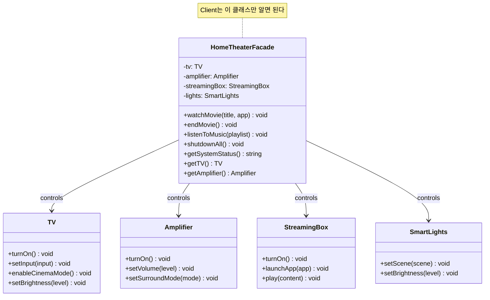

# Facade (퍼사드) 패턴

**분류:** 구조 패턴 (Structural Pattern)

---

## 의도 (Intent)

복잡한 서브시스템에 대한 **간단한 인터페이스를 제공**한다. 클라이언트는 복잡한 내부 동작을 몰라도 단순한 메서드 호출만으로 원하는 결과를 얻을 수 있다.

---

## 핵심 개념 설명

### 복잡성 숨기기

홈시어터를 켜려면:
1. 조명을 영화 모드로 변경 (SmartLights API)
2. TV 켜기 → 시네마 모드 활성화 → HDMI 입력 설정 (TV API)
3. 앰프 켜기 → 서라운드 모드 설정 → 볼륨 조절 (Amplifier API)
4. 스트리밍 박스 켜기 → 앱 실행 → 콘텐츠 재생 (StreamingBox API)

이 과정을 매번 클라이언트가 직접 수행해야 한다면? 순서를 틀리면 오류가 발생한다. 서비스 API가 바뀌면 모든 클라이언트 코드를 수정해야 한다.

퍼사드는 이 복잡한 과정을 `watchMovie("인터스텔라")` 한 줄로 숨긴다.

### 퍼사드는 서브시스템을 완전히 숨기지 않는다

퍼사드는 서브시스템에 대한 **선택적 접근 제한**이 아니라 **편의를 위한 단순화**이다. 고급 사용자는 여전히 `facade.getTV().setBrightness(40)` 처럼 서브시스템에 직접 접근할 수 있다.

### 레이어 아키텍처와의 관계

현대 웹 개발의 계층 구조:
```
Controller (퍼사드 역할)
    → Service Layer
        → Repository, Cache, External API
```

Service 계층이 여러 Repository와 외부 API를 조율하는 것이 퍼사드 패턴의 실제 적용 예시다.

---

## 구조 다이어그램



---

## 실무 사용 사례

| 사례 | 퍼사드 | 서브시스템 |
|------|--------|-----------|
| 웹 프레임워크 | Express/Fastify 앱 | HTTP 파싱, 라우팅, 미들웨어 체인 |
| ORM | Sequelize/TypeORM | SQL 생성, 커넥션 풀, 트랜잭션 |
| 결제 서비스 | PaymentService | 카드사 API, 사기 탐지, 영수증 발송 |
| 이메일 발송 | EmailService | SMTP, 템플릿 렌더링, 첨부파일 처리 |
| 주문 처리 | OrderService | 재고, 결제, 배송, 알림 시스템 |

---

## 장단점

### 장점
- **복잡성 숨기기**: 클라이언트가 서브시스템의 세부 사항을 몰라도 된다.
- **결합도 감소**: 클라이언트와 서브시스템 간의 직접 의존성이 줄어든다.
- **코드 가독성**: 고수준의 의도를 표현하는 메서드명(`watchMovie`)이 명확하다.
- **점진적 리팩토링**: 복잡한 레거시 시스템에 퍼사드를 씌워 점진적으로 개선할 수 있다.

### 단점
- **과도한 집중**: 퍼사드가 너무 많은 역할을 맡으면 "갓 객체(God Object)"가 된다.
- **서브시스템 접근 제한**: 퍼사드가 제공하지 않는 기능에 접근하기 불편할 수 있다.
- **추가 레이어**: 불필요한 경우 단순히 복잡성만 늘릴 수 있다.

---

## 관련 패턴

- **Adapter**: 어댑터는 인터페이스를 *변환*하고, 퍼사드는 인터페이스를 *단순화*한다.
- **Mediator**: 중재자는 서브시스템 간의 양방향 통신을 조율하고, 퍼사드는 단방향 단순화를 제공한다.
- **Singleton**: 퍼사드를 싱글턴으로 구현하는 경우가 많다 (하나의 진입점).
- **Abstract Factory**: 퍼사드의 대안으로 서브시스템 객체를 생성하는 방식을 추상화할 수 있다.

## Vue 구현

### Vue에서 이 패턴이 어떻게 표현되는가

Vue에서 Facade는 **여러 서브시스템 composable을 하나로 통합하는 composable**로 구현한다.

```ts
function useHomeTheater() {
  // 서브시스템 composable들을 내부에 보유
  const tv = useTV()
  const amp = useAmplifier()
  const streaming = useStreamingBox()
  const lights = useLights()

  // Facade 메서드: 복잡한 순서를 하나로 통합
  function watchMovie(title: string) {
    lights.setScene('영화')       // 1단계
    tv.turnOn(); tv.enableCinemaMode(); tv.setInput('HDMI1')  // 2단계
    amp.turnOn(); amp.setSurroundMode('돌비 애트모스')         // 3단계
    streaming.turnOn(); streaming.play(title)                  // 4단계
  }

  return { watchMovie, endMovie, tv, amp, streaming, lights }
}
```

### TS 구현과의 차이점

| TypeScript | Vue |
|---|---|
| `HomeTheaterFacade` 클래스 | `useHomeTheater()` composable |
| 생성자에서 서브시스템 주입 | composable 내부에서 서브시스템 composable 호출 |
| 서브시스템 직접 접근 getter | composable 반환값에 서브시스템 포함 |

### 사용된 Vue 개념

- **composable 합성**: 여러 작은 composable을 하나의 Facade composable 안에서 조합
- **`reactive()`**: 각 서브시스템 상태를 반응형으로 관리해 UI 자동 갱신
- **단일 진입점**: 클라이언트는 `useHomeTheater()`만 import하면 된다

## React 구현

### React에서 이 패턴이 어떻게 표현되는가

`useHomeTheater()` 커스텀 훅 하나가 4개 서브시스템의 복잡한 상태를 단순한 API로 통합한다.

```
useHomeTheater()          ← Facade 훅
  ├─ tv, amp, streaming, lights  (내부 서브시스템 상태)
  ├─ watchMovie()         ← 클라이언트에게 노출되는 단순 메서드
  ├─ endMovie()
  ├─ listenToMusic()
  └─ shutdownAll()

ControlPanel (Client)
  └─ theater.watchMovie('인터스텔라')  ← Facade만 사용
```

- 클라이언트(`ControlPanel`)는 `useHomeTheater()` 하나만 import한다. TV/앰프/스트리밍/조명의 개별 훅을 알 필요 없다.
- 4개 서브시스템의 초기화 순서와 의존성은 Facade 훅 내부에 캡슐화된다.
- Facade는 서브시스템을 완전히 숨기지 않는다 — 상태 조회는 읽기 전용으로 노출한다.

### TS 구현과의 차이점

| TS 구현 | React 구현 |
|---|---|
| `HomeTheaterFacade` 클래스 | `useHomeTheater()` 커스텀 훅 |
| 서브시스템 클래스 인스턴스 | 각 서브시스템의 `useState` |
| `watchMovie()` 메서드 | 동일한 이름의 `useCallback` 함수 |

### 사용된 React 개념

- 커스텀 훅 조합: 여러 `useState`를 하나의 훅으로 통합
- `useCallback`: 퍼사드 메서드 메모이제이션
- 관심사 분리: 복잡한 로직을 훅 내부에 캡슐화

---

## Svelte 구현

### Svelte에서 이 패턴이 어떻게 표현되는가?

Svelte 5에서는 각 서브시스템을 `$state` 객체로 관리하고, **Facade 함수들이 여러 `$state`를 올바른 순서로 변경**한다. 클라이언트(UI)는 `watchMovie()` 한 함수만 호출하면 되고, 내부 순서(조명→TV→앰프→스트리밍)는 Facade 함수가 담당한다.

```svelte
<script lang="ts">
  let tv = $state({ isOn: false, mode: '일반' })
  let amp = $state({ isOn: false, volume: 30 })
  // ...

  // Facade 메서드: 복잡한 순서를 캡슐화
  function watchMovie(title: string) {
    lights.brightness = 10        // 1. 조명 먼저
    tv.isOn = true                // 2. TV 켜기
    amp.isOn = true; amp.volume = 40  // 3. 앰프
    streaming.content = title    // 4. 재생
  }
</script>
```

### TS 구현과의 차이점

| TypeScript | Svelte 5 |
|-----------|---------|
| `HomeTheaterFacade` 클래스가 인스턴스 보유 | Facade 함수들이 `$state` 직접 변경 |
| 메서드 호출로 서브시스템 조작 | `$state` 대입으로 서브시스템 상태 변경 |
| 서브시스템 접근 게터 제공 | `$state` 변수를 직접 바인딩해 고급 제어 |

### 사용된 Svelte 5 개념

- **`$state`**: 각 서브시스템의 상태를 독립적인 반응형 객체로 관리
- **`$derived`**: 전체 시스템 상태 요약을 자동 계산
- **반응형 UI**: `$state` 변경 시 모든 서브시스템 상태 표시가 즉시 업데이트
