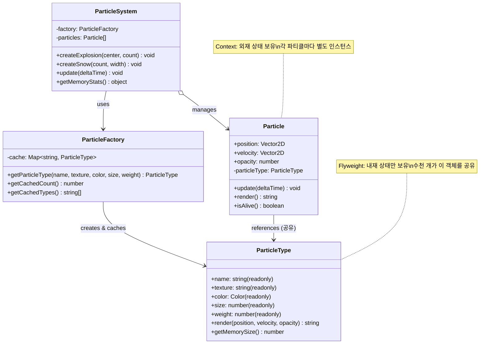

# Flyweight (플라이웨이트) 패턴

**분류:** 구조 패턴 (Structural Pattern)

---

## 의도 (Intent)

공유를 통해 **많은 수의 세밀한 객체를 효율적으로 지원**한다. 객체에서 공유 가능한 부분(intrinsic state)을 분리하여 메모리 사용량을 대폭 줄인다.

---

## 핵심 개념 설명

### Intrinsic vs Extrinsic State

플라이웨이트 패턴의 핵심은 상태를 두 종류로 분리하는 것이다:

**내재 상태 (Intrinsic State)**: 공유 가능한 상태
- 객체 내부에 저장된다.
- 모든 컨텍스트에서 동일한 값을 가진다.
- 불변(immutable)이어야 한다.
- 예: 파티클의 텍스처, 색상, 크기 (같은 종류의 파티클은 동일)

**외재 상태 (Extrinsic State)**: 공유 불가능한 상태
- 객체 외부에서 전달된다 (파라미터로).
- 각 컨텍스트마다 다른 값을 가진다.
- 예: 파티클의 현재 위치, 속도 (각 파티클마다 다름)

### 메모리 절약 계산

```
파티클 시스템: 10,000개의 불꽃 파티클

플라이웨이트 없이:
  10,000개 × (텍스처 1MB + 위치/속도 48B) ≈ 10,000MB (약 10GB)

플라이웨이트 적용 후:
  텍스처 1MB (공유) + 10,000개 × 48B (외재 상태) ≈ 1MB + 0.5MB ≈ 1.5MB

절약: 약 6700배
```

### 팩토리가 핵심

FlyweightFactory(캐시)가 없으면 플라이웨이트 패턴이 아니다. 팩토리가 동일한 내재 상태를 가진 객체를 캐싱하고 재사용하는 역할을 한다.

---

## 구조 다이어그램



---

## 실무 사용 사례

| 사례 | Flyweight (공유) | Context (개별) |
|------|----------------|---------------|
| 게임 파티클 | 텍스처, 색상 | 위치, 속도, 수명 |
| 텍스트 렌더링 | 글꼴, 문자 모양 | 문자 위치, 색상 |
| 지도 마커 | 아이콘 이미지 | 좌표, 팝업 내용 |
| 체스 말 | 말의 이미지/규칙 | 현재 위치 |
| 웹 DOM 재사용 | 컴포넌트 클래스 정의 | 인스턴스 데이터 |

---

## 장단점

### 장점
- **메모리 절약**: 많은 유사 객체를 처리할 때 메모리를 획기적으로 줄인다.
- **성능 향상**: 객체 생성 비용이 감소한다.
- **확장성**: 수백만 개의 객체도 처리 가능하다.

### 단점
- **CPU vs 메모리 트레이드오프**: 외재 상태를 매번 계산하거나 전달하는 CPU 비용이 증가한다.
- **코드 복잡도**: intrinsic/extrinsic 상태 분리가 코드를 복잡하게 만든다.
- **불변성 요구**: 공유 객체가 불변이어야 하므로, 설계 제약이 생긴다.
- **적용 범위 제한**: 유사한 객체가 매우 많을 때만 의미 있는 패턴이다.

---

## 관련 패턴

- **Composite**: 플라이웨이트를 컴포지트 트리의 Leaf 노드로 사용하면 메모리를 절약할 수 있다.
- **Singleton**: 팩토리 자체를 싱글턴으로 구현하는 경우가 많다.
- **State**: 상태 객체를 플라이웨이트로 구현하면 상태 전환 비용을 줄일 수 있다.
- **Factory Method**: FlyweightFactory는 팩토리 메서드 패턴을 활용하여 플라이웨이트를 생성한다.
