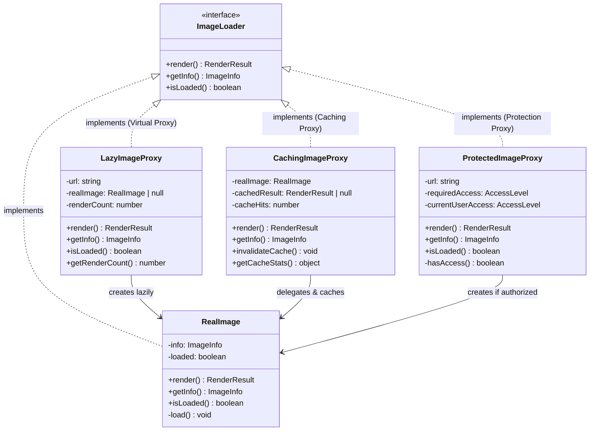

# Proxy (프록시) 패턴

**분류:** 구조 패턴 (Structural Pattern)

---

## 의도 (Intent)

다른 객체에 대한 **대리자(surrogate) 또는 자리 표시자(placeholder)**를 제공한다. 프록시는 원본 객체에 대한 접근을 제어하여, 요청이 원본에 도달하기 전후에 추가 작업을 수행할 수 있다.

---

## 핵심 개념 설명

### 프록시의 세 가지 핵심 역할

**1. 가상 프록시 (Virtual Proxy)**: 생성 비용이 큰 객체를 실제로 필요할 때까지 생성을 지연한다.

```
갤러리에 1000개의 이미지가 있을 때:
- 프록시 없이: 1000개 모두 즉시 로드 → 느린 시작, 많은 메모리
- 가상 프록시: 화면에 보이는 것만 로드 → 빠른 시작, 적은 메모리
```

**2. 캐싱 프록시 (Caching Proxy)**: 비용이 큰 연산의 결과를 캐시하여 재사용한다.

```
같은 이미지를 10번 렌더링:
- 프록시 없이: 10번 렌더링 연산
- 캐싱 프록시: 1번 렌더링 + 9번 캐시 반환 (90% 절약)
```

**3. 보호 프록시 (Protection Proxy)**: 접근 권한을 확인하고 권한 없는 요청을 차단한다.

```
프리미엄 콘텐츠 접근:
- 프록시가 권한을 확인한 후 실제 객체에 접근을 허용하거나 차단한다
```

### 프록시 vs 데코레이터

두 패턴 모두 같은 인터페이스를 구현하고 대상 객체를 래핑하지만 **목적**이 다르다:

| | 프록시 | 데코레이터 |
|--|--------|----------|
| 목적 | 접근 제어 | 기능 추가 |
| 객체 생성 | 프록시가 직접 RealSubject를 생성하는 경우가 많음 | 외부에서 생성한 객체를 주입 |
| 사용 시점 | 클라이언트가 모르게 투명하게 작동 | 명시적으로 래핑 |

---

## 구조 다이어그램



---

## 실무 사용 사례

| 프록시 종류 | 사례 |
|------------|------|
| 가상 프록시 | 이미지 지연 로딩, ORM의 Lazy Loading (관계 데이터) |
| 캐싱 프록시 | HTTP 캐싱, CDN, 메모이제이션, Redis 캐시 레이어 |
| 보호 프록시 | API 인증 미들웨어, 역할 기반 접근 제어 (RBAC) |
| 원격 프록시 | gRPC 스텁, REST API 클라이언트, GraphQL 리졸버 |
| 로깅 프록시 | AOP 기반 메서드 호출 로깅, 성능 측정 |
| 스마트 참조 | 참조 카운팅, 약한 참조 관리 |

---

## 장단점

### 장점
- **개방-폐쇄 원칙**: RealSubject를 수정하지 않고 기능을 추가한다.
- **지연 초기화**: 실제로 필요할 때까지 무거운 객체 생성을 미룬다.
- **투명한 캐싱**: 클라이언트 코드를 변경하지 않고 캐싱을 추가한다.
- **접근 제어**: 보안 정책을 한 곳에서 관리한다.

### 단점
- **응답 지연**: 추가 레이어로 인해 응답이 약간 느려질 수 있다.
- **코드 복잡도**: 프록시 클래스가 늘어난다.
- **예상치 못한 동작**: 클라이언트가 프록시를 모르는 경우 예상과 다른 동작을 경험할 수 있다.

---

## 관련 패턴

- **Decorator**: 구조가 유사하지만 목적이 다르다. 데코레이터는 기능 추가, 프록시는 접근 제어.
- **Adapter**: 어댑터는 인터페이스를 변환하고, 프록시는 같은 인터페이스를 유지한다.
- **Facade**: 퍼사드는 단순화된 인터페이스를 제공하고, 프록시는 동일한 인터페이스를 제공한다.
- **Flyweight**: 플라이웨이트는 공유로 메모리를 절약하고, 프록시는 접근 제어나 지연 로딩에 초점을 맞춘다.

## Vue 구현

### Vue에서 이 패턴이 어떻게 표현되는가

Vue에서 Proxy는 세 가지 방식으로 구현한다.

**1. 가상 프록시 — `defineAsyncComponent`**
```ts
// 실제 컴포넌트를 필요한 시점(렌더링 시)에만 로드한다
const HeavyChartProxy = defineAsyncComponent({
  loader: () => import('./HeavyChart.vue'),
  loadingComponent: LoadingSpinner,
})
```

**2. 캐싱 프록시 — composable Map 캐시**
```ts
function useCachedFetch() {
  const cache = new Map<string, string>()
  async function fetch(url: string) {
    if (cache.has(url)) return cache.get(url)!  // 캐시 히트
    const result = await realFetch(url)          // 캐시 미스
    cache.set(url, result)
    return result
  }
  return { fetch }
}
```

**3. 보호 프록시 — 권한 체크 composable**
```ts
function useProtectedResource(requiredLevel: AccessLevel) {
  const canAccess = computed(() => levels[currentUser] >= levels[requiredLevel])
  // canAccess가 false면 실제 리소스를 로드하지 않는다
}
```

### TS 구현과의 차이점

| TypeScript | Vue |
|---|---|
| `LazyImageProxy` 클래스 | `defineAsyncComponent` |
| `CachingImageProxy` 클래스 | `useCachedFetch()` composable |
| `ProtectedImageProxy` 클래스 | `useProtectedResource()` composable |

### 사용된 Vue 개념

- **`defineAsyncComponent`**: Vue 내장 가상 프록시, 컴포넌트를 필요 시점에 지연 로드
- **`<Suspense>`**: 비동기 컴포넌트 로딩 중 fallback UI 표시
- **`computed()`**: 권한 상태 변경 시 접근 가능 여부 자동 재계산

## React 구현

### React에서 이 패턴이 어떻게 표현되는가

두 가지 프록시를 커스텀 훅으로 구현한다.

**가상 프록시 (지연 로딩):**
```
useLazyImageProxy(url)
  ├─ load() 호출 전: 아무것도 로드하지 않음
  └─ load() 호출 후: 실제 이미지 로딩 시작
```

**캐싱 프록시:**
```
useCachedImageProxy()
  ├─ render(url) — 캐시 히트: 즉시 반환
  └─ render(url) — 캐시 미스: 실제 로딩 후 캐시 저장
```

- `React.lazy + Suspense`가 React 내장 가상 프록시의 전형적인 예다.
- `useLazyImageProxy`는 `load()` 호출 전까지 실제 이미지를 로드하지 않는다 — `LazyImageProxy.render()` 최초 호출 시 초기화와 동일.
- `useCachedImageProxy`는 모듈 레벨 `Map`으로 캐시를 구현해 여러 컴포넌트가 캐시를 공유한다.

### TS 구현과의 차이점

| TS 구현 | React 구현 |
|---|---|
| `class LazyImageProxy implements ImageLoader` | `useLazyImageProxy()` 훅 |
| `this.realImage: RealImage \| null` | `useRef<boolean>(false)` (로드 여부 추적) |
| `CachingImageProxy` 인스턴스별 캐시 | 모듈 레벨 `Map` (전역 공유 캐시) |

### 사용된 React 개념

- `useRef`: 중복 로드 방지 플래그 (리렌더링 무관)
- 모듈 레벨 변수: 전역 캐시 공유
- `async/await` + `useState`: 비동기 로딩 상태 관리

---

## Svelte 구현

### Svelte에서 이 패턴이 어떻게 표현되는가?

Svelte 5에서는 세 종류의 프록시를 모두 `$state`로 구현한다. **가상 프록시**는 `loadedImages` Set으로 지연 로딩을 제어하고, **캐싱 프록시**는 `imageCache` Map으로 중복 로드를 방지하며, **보호 프록시**는 `currentAccessLevel` 값으로 접근을 제어한다.

```svelte
<script lang="ts">
  let loadedImages = $state<Set<number>>(new Set())  // 가상 프록시
  let imageCache = $state<Map<number, {...}>(new Map()) // 캐싱 프록시
  let currentAccessLevel = $state<AccessLevel>('guest') // 보호 프록시

  async function loadImage(img) {
    if (!hasAccess(img.requiredAccess)) return   // 보호 프록시
    if (imageCache.has(img.id)) { cacheHits++; return } // 캐싱 프록시
    // 실제 로드 (가상 프록시 — 처음만 실행)
    await fetch(img.url)
    imageCache.set(img.id, { loadTime: ... })
  }
</script>
```

### TS 구현과의 차이점

| TypeScript | Svelte 5 |
|-----------|---------|
| `LazyImageProxy` 클래스 (null 체크로 지연) | `$state` Set으로 로드 여부 추적 |
| `CachingImageProxy.cachedResult` 필드 | `$state` Map으로 캐시 저장 |
| `ProtectedImageProxy` 권한 검사 | `$state` 접근 레벨 + 함수로 검사 |

### 사용된 Svelte 5 개념

- **`$state<Set>`**: 가상 프록시 — 어떤 이미지가 로드됐는지 추적
- **`$state<Map>`**: 캐싱 프록시 — ID별 캐시 데이터 저장
- **`$derived`**: 캐시 히트율 등 통계 자동 계산
